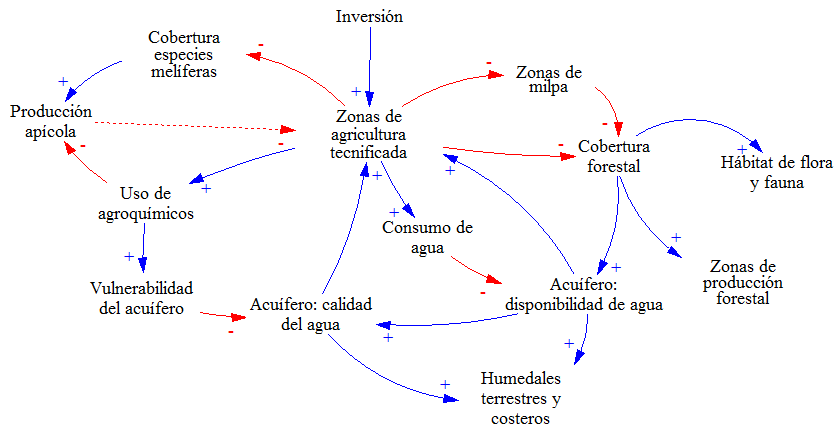

# Agricultura

<!-- Ruta de la documentación:
FOMIX\fmx_estudio_tecnico\diagnostico\talleres\sphinx\docs -->

[Lista de participantes](https://www.dropbox.com/s/06d1mxg53vb48kg/asistencia_taller_pron_agr_14oct21.pdf?dl=0)

### Diagrama que representa los efectos del crecimiento agrícola

### Variables del diagrama que representa los efectos del crecimiento agrícola

Variable | Definición | Unidades
-- | -- | --
Acuífero: calidad del agua | Índice | Adimensional
Acuífero: disponibilidad de agua | Disponibilidad Media Anual de Agua Subterránea | Hectómetros cúbicos
Cobertura de especies melíferas | Superficie de distribución de especies melíferas | Hectáreas
Cobertura   forestal | Superficie con cobertura forestal | Hectáreas
Consumo de agua | Volumen de agua para consumo agrícola | Hectómetros cúbicos
Hábitat de flora y fauna | Superficie total del hábitat interior de parches de vegetación natural | Hectáreas
Humedales terrestres y costeros | Superficie de humedales costeros, cenotes, dolinas, aguadas, etc. | Hectáreas
Inversión | Programas de fomento gubernamentales o inversión de los productores | Pesos
Producción apícola | Producción de miel | Toneladas
Uso de agroquímicos | Superficie cultivada con aplicación de fertilizantes | Hectáreas
Vulnerabilidad del acuífero | Superficie de acuífero con vulnerabilidad alta a la contaminación | Hectáreas
Zonas de agricultura tecnificada | Superficies con uso de agricultura tecnificada de temporal y de riego | Hectáreas
Zonas de milpa | Zonas de milpa maya | Hectáreas
Zonas de producción forestal | Zonas de aprovechamiento forestal | Hectáreas

### Interacciones del diagrama que representa los efectos del crecimiento agrícola

Variable causante | Variable afectada | Efecto | Dirección | Intensidad
-- | -- | -- | -- | --
Zonas de agricultura tecnificada | Zonas de milpa | Si las zonas de agricultura tecnificada aumentan, las zonas de milpa disminuyen | - | M, MB
Zonas de milpa | Cobertura forestal | Si las zonas de milpa aumentan, la cobertura forestal disminuye y se fragmenta | - | NE
Zonas de agricultura tecnificada | Cobertura forestal | Si las zonas agrícolas aumentan, la cobertura forestal disminuye y se fragmenta | - | B (centro y oriente)    F(sur)
Cobertura forestal | Hábitat de flora y fauna | Si la cobertura forestal aumenta,  el    hábitat de flora y fauna aumenta | + | NE
Cobertura forestal | Acuífero: disponibilidad de agua | Si la cobertura forestal aumenta, las zonas de recarga del acuífero aumentan | + | NE
Zonas de agricultura tecnificada | Cobertura de especies melíferas | Si las zonas agrícolas aumentan, la cobertura de especies melíferas disminuye | - | F, M
Cobertura de especies melíferas | Producción apícola | Si la cobertura de especies melíferas aumenta,  la producción de miel aumenta | + | NE
Zonas de agricultura tecnificada | Uso de agroquímicos | Si aumentan las zonas de agricultura tecnificada ,    el uso de agroquímicos aumenta | + | MF, F
Uso de agroquímicos | Producción apícola | Si el uso de agroquímicos aumenta, la producción de miel disminuye por la muerte de abejas y la contaminación de la miel | - | F
Producción apícola | Zonas de agricultura tecnificada | Si aumenta la presión social por los efectos en la apicultura de los cultivos de transgénicos, las zonas de agricultura tecnificada pueden disminuir | - | NE
Uso de agroquímicos | Vulnerabilidad del acuífero | Si aumenta el uso de agroquímicos, la    vulnerabilidad específica de contaminación del acuífero aumenta | + | F (norte y oriente)    M(sur)
Vulnerabilidad del acuífero | Acuífero: calidad de agua | Si aumenta la vulnerabilidad específica de contaminación del acuífero, la calidad    del agua disminuye | - | MF, F
Acuífero: calidad de agua | Zonas de agricultura tecnificada | Si aumenta la calidad del agua, las zonas aptas para la agricultura tecnificada aumentan | + | NE
Zonas de agricultura tecnificada | Consumo de agua | Si aumentan las zonas de agricultura tecnificada, la demanda de agua para riego aumenta | + | NE
Consumo de agua | Acuífero: disponibilidad de agua | Si aumenta el consumo de agua, la disponibilidad de agua en el acuífero disminuye | - | MF, F (sur, Motul)
Acuífero: disponibilidad de agua | Acuífero: calidad de agua | Si aumenta la disponibilidad de    agua del acuífero la calidad de agua del acuífero aumenta por dilución | + | NE
Acuífero: disponibilidad de agua | Humedales terrestres y costeros | Si aumenta la disponibilidad de agua del acuífero, el flujo de agua a los humedales aumenta | + | NE
Acuífero: calidad de agua | Humedales terrestres y costeros | Si aumenta la disponibilidad de    agua del acuífero, la calidad de agua que fluye a los humedales aumenta | + | NE
Humedales terrestres y costeros | Hábitat de flora y fauna | Si aumenta la extensión y la calidad de agua de los humedales, el hábitat de flora y fauna aumenta | + | NE

