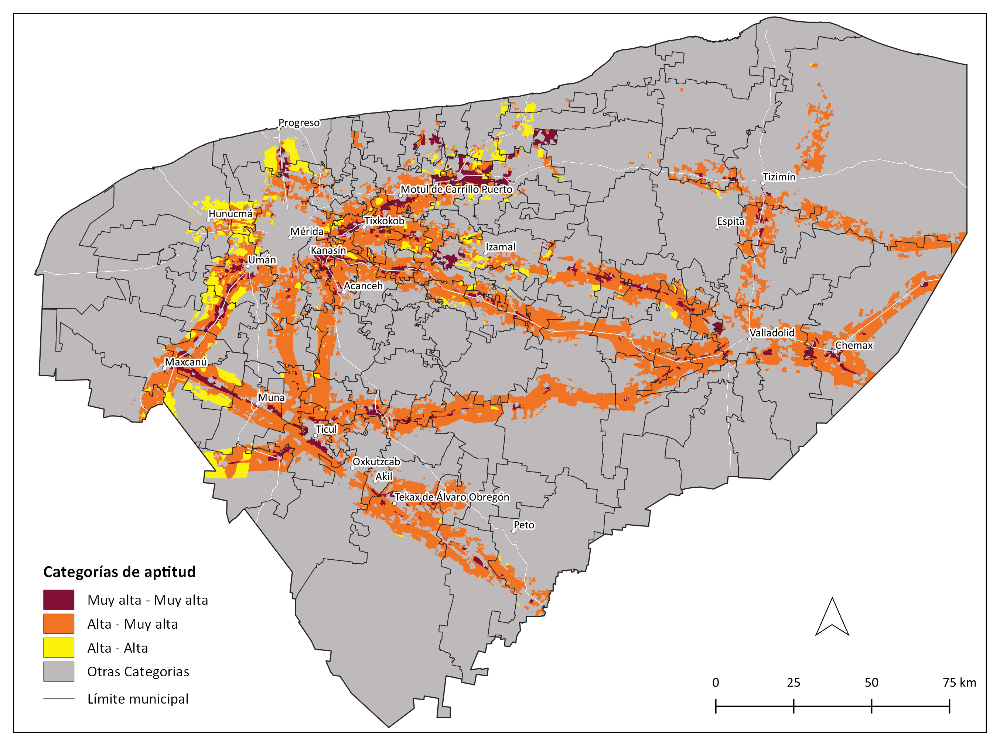
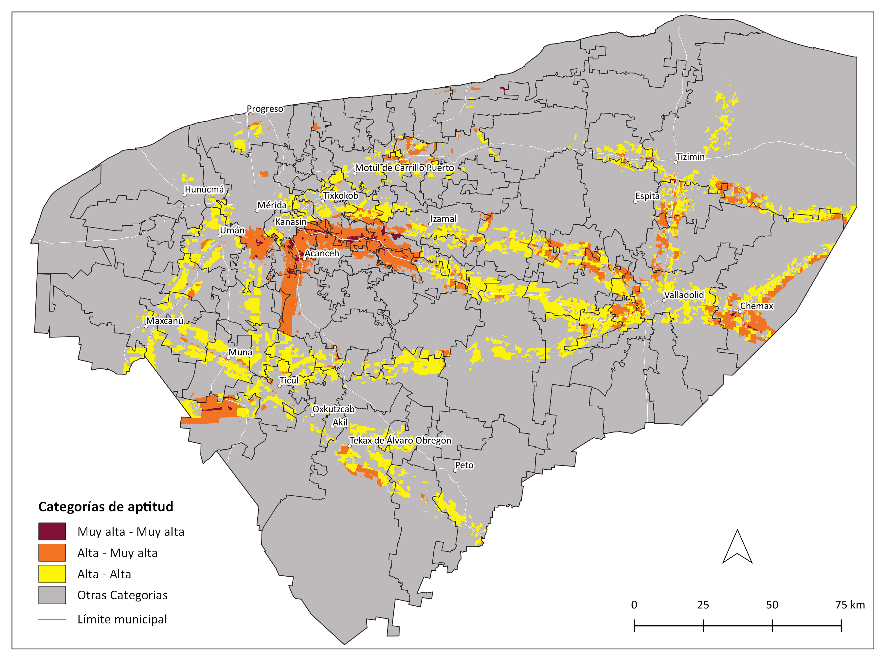
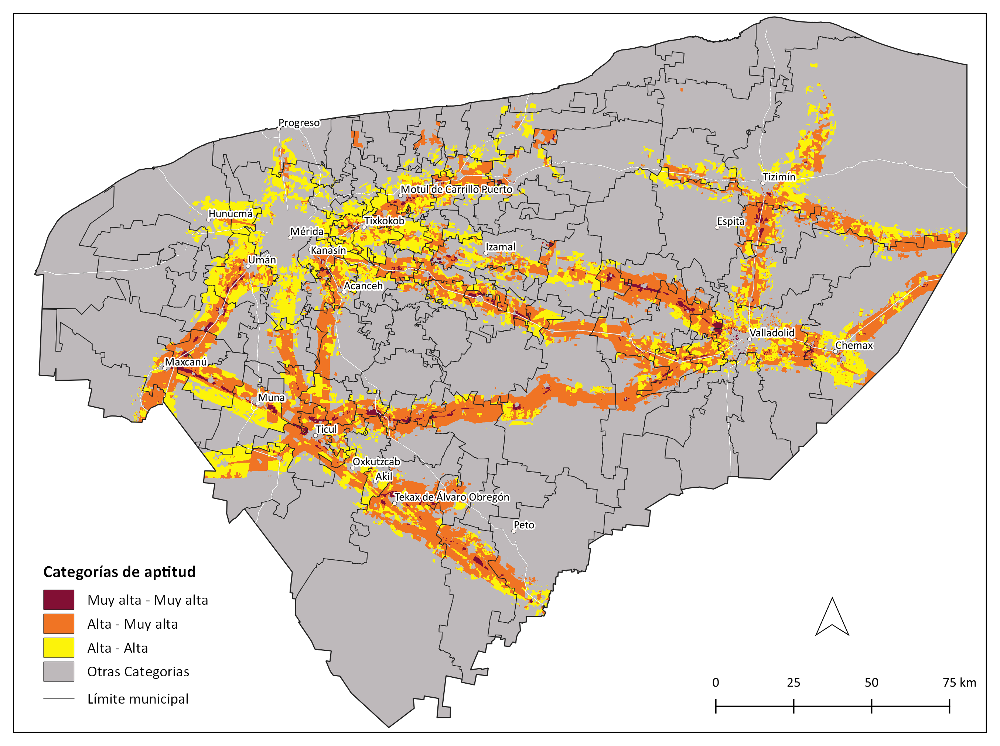

# Energía renovable

## Energía renovable **vs.** Apicultura

### Descripción del conflicto

* Deforestación, fragmentación de ecosistemas y desplazamiento de actividades de milpa y apicultura por la construcción de proyectos de energía y líneas de transmisión eléctrica.

#### Recursos afectados

* Vegetación forestal.

#### Ubicación reportada

- Municipios: Cansahcab, Cuncunul, Dzidzantún, Dzilam de Bravo, Ixil, Izamal, Motul, Muna, Peto, Progreso, Sacalum, Sinanché, Sucilá, Suma, Telchac Pueblo, Temax, Tepakán, Teya, Ticul, Tinum, Ti-zimín, Valladolid y Yobaín.
- UMAFOR 3105: 16 municipios (Cenotillo, Chankom, Dzitás, Hocabá, Hoctún, Huhí, Izamal, Kantu-nil, Quintana Roo, Sanahcat, Sotuta, Sudzal, Tekal de Venegas, Tunkás, Xocchel, Yaxcabá).

#### Fuentes

- Articulación Yucatán y GeoComunes 2019, El Mekaoui 2018, Reyes Maturano 2017, Ch´iibal Ma-yao´ob A.C. 2011.
- Taller milpa maya y apicultura.
- Clave de registro en encuesta de conflictos ambientales: F12 y F21.

### Superficie de conflicto por categorías de aptitud (km²)

### Mapa de conflictos

### Índices de conflictos ambientales

Los índices indican la severidad del conflicto y pueden tener valores entre 0 y 1.

## Energía renovable **vs.** Conservación

### Descripción del conflicto

* - Afectación a hábitat de aves migratorias por instalación de parques eólicos cerca de cenotes, hu-medales y dunas costeras.
- Deforestación, fragmentación de ecosistemas y desplazamiento de actividades de milpa y apicul-tura por la construcción de proyectos de energía y líneas de transmisión eléctrica.
- Contaminación por el uso de agroquímicos en el cultivo de sorgo y Jatropha para su uso como bio-combustibles.
- Contaminación atmosférica por emisiones generada por la producción de energías convenciona-les, que contribuyen al cambio climático.

#### Recursos afectados

* Agua, aire, vegetación forestal, fauna.

#### Ubicación reportada

- Municipios: Cansahcab, Cuncunul, Dzidzantún, Dzilam de Bravo, Ixil, Izamal, Motul, Muna, Peto, Progreso, Sacalum, Sinanché, Sucilá, Suma, Telchac Pueblo, Temax, Tepakán, Teya, Ticul, Tinun, Tizimín, Valladolid y Yobaín.
- UMAFOR 3105: 16 municipios (Cenotillo, Chankom, Dzitás, Hocabá, Hoctún, Huhí, Izamal, Kantu-nil, Quintana Roo, Sanahcat, Sotuta, Sudzal, Tekal de Venegas, Tunkás, Xocchel, Yaxcabá).

#### Fuentes

- Articulación Yucatán y GeoComunes 2019, Aguilar‑Sánchez et al. 2018, El Mekaoui 2018, Reyes Maturano 2017, Sacramento Rivero et al. 2016, Zárate Toledo y Fraga 2016, Ch´iibal Mayao´ob A.C. 2011.
- Taller de energía.
- Clave de registro en encuesta de conflictos ambientales: F12, F21 y F27.

### Superficie de conflicto por categorías de aptitud (km²)

### Mapa de conflictos

### Índices de conflictos ambientales

Los índices indican la severidad del conflicto y pueden tener valores entre 0 y 1.

## Energía renovable **vs.** Milpa maya

### Descripción del conflicto:

- Deforestación, fragmentación de ecosistemas y desplazamiento de actividades de milpa y apicul-tura por la construcción de proyectos de energía y líneas de transmisión eléctrica.

### Recursos afectados:

Vegetación forestal.

### Ubicación reportada:

- Municipios: Cansahcab, Cuncunul, Dzidzantún, Dzilam de Bravo, Ixil, Izamal, Motul, Muna, Peto, Progreso, Sacalum, Sinanché, Sucilá, Suma, Telchac Pueblo, Temax, Tepakán, Teya, Ticul, Tinun, Tizimín, Valladolid y Yobaín.
- UMAFOR 3105: 16 municipios (Cenotillo, Chankom, Dzitás, Hocabá, Hoctún, Huhí, Izamal, Kantu-nil, Quintana Roo, Sanahcat, Sotuta, Sudzal, Tekal de Venegas, Tunkás, Xocchel, Yaxcabá).

### Fuentes:

- Articulación Yucatán y GeoComunes 2019, El Mekaoui 2018, Reyes Maturano 2017, Ch´iibal Ma-yao´ob A.C. 2011.
- Taller de energía.
- Clave de registro en encuesta de conflictos ambientales: F12 y F21.

### Superficie de conflicto por categorías de aptitud (km²)

### Mapa de conflictos

### Índices de conflictos ambientales

Los índices indican la severidad del conflicto y pueden tener valores entre 0 y 1.

