# Energía

<!-- Ruta de la documentación:
FOMIX\fmx_estudio_tecnico\diagnostico\talleres\sphinx\docs -->

## Meta

Garantizar el aprovechamiento sostenible de los recursos energéticos del estado de Yucatán, para asegurar que la población y los sectores productivos tengan acceso a energía asequible, sostenible, confiable y de calidad, en un marco de justicia ambiental que considere criterios de uso sostenible del territorio, certidumbre jurídica y contribuya a una mayor democracia en la gestión de los recursos energéticos públicos y comunes.

[Lista de participantes](https://www.dropbox.com/s/h8zuorcqva9gr9e/lista_asistencia_energia.pdf?dl=0)

## 1. Energías renovables

### 1.1 Modelo de decisión

### 1.2 Fuentes

#### 1.2.1 Solar

Instalaciones industriales que aprovechan la irradiación solar como fuente de energía.

Atributos | Definición
-- | --
Distancia a red eléctrica | Distancia a líneas de transmisión y subestaciones.
Cobertura | Tipo de vegetación.
Tenencia de la tierra | Áreas ejidales (comunitaria o parcelada) y no ejidales.

##### 1.2.1.1 Distancia a red eléctrica

Distancia a líneas de transmisión y subestaciones.

**Insumos**

Capa | Distancia líneas de transmisión de energía eléctrica
-- | --
Fuente | Líneas de transmisión en México. GeoComunes con datos de CFE
Año | 2010
Escala | Sin dato
Unidades | Kilómetros

**Parámetros de la función de valor**

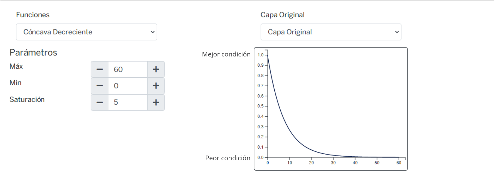   

**Función de valor de distancia a red eléctrica**

##### 1.2.1.2 Cobertura

Tipo de vegetación.

**Insumos**

Campo | Uso del suelo y vegetación
-- | --
Fuente | [1] Conjunto de datos vectoriales de la carta de Uso del suelo y vegetación. Serie VI. Conjunto Nacional INEGI y [2] Mapa de uso del suelo y vegetación de la zona costera asociada a los manglares, Región Península de Yucatán CONABIO
Año | [1] 2017; [2] 2021
Campo | [1] descripcio; [2] Descrip
Escala | [1] 1:250,000; [2] 1:50,000
Unidades | Adimensional

**Parámetros de la función de valor**

ID | Categoría | Importancia | FV
-- | -- | -- | --
2 | Agricultura de riego | Máxima | 1.00
3 | Agricultura de temporal | Máxima | 1.00
5 | Bosque cultivado/Palmar inducido | Máxima | 1.00
8 | Pastizal | Máxima | 1.00
11 | Sin vegetación | Máxima | 1.00
4 | Asentamiento humano | Moderada | 0.70
9 | Selva baja | Baja | 0.56
10 | Selva mediana | Baja | 0.56
12 | Sabana | Muy baja | 0.33
1 | Acuícola | Nula | 0.00
6 | Cuerpo de agua | Nula | 0.00
7 | Manglar | Nula | 0.00
13 | Tular | Nula | 0.00
14 | Vegetación de duna costera | Nula | 0.00
15 | Vegetación de petén | Nula | 0.00
16 | Vegetación halófila hidrófila | Nula | 0.00
17 | ND | Nula | 0.00

**Función de valor de cobertura**

##### 1.2.1.3 Tenencia de la tierra

Áreas ejidales (comunitaria o parcelada) y no ejidales.

**Insumos**

Capa | Tenencia de la tierra
-- | --
Fuente | [1] Zonas de Tierras Parceladas RAN y [2] Tierra de uso común RAN
Año | 2020
Escala | Sin dato
Unidades | Adimensional

**Parámetros de la función de valor**

ID | Categoria | FV
-- | -- | --
3 | No ejidal | 1.00
2 | Zona de tierras parceladas | 0.52
1 | Tierra de uso común | 0.19

**Función de valor de tenencia**

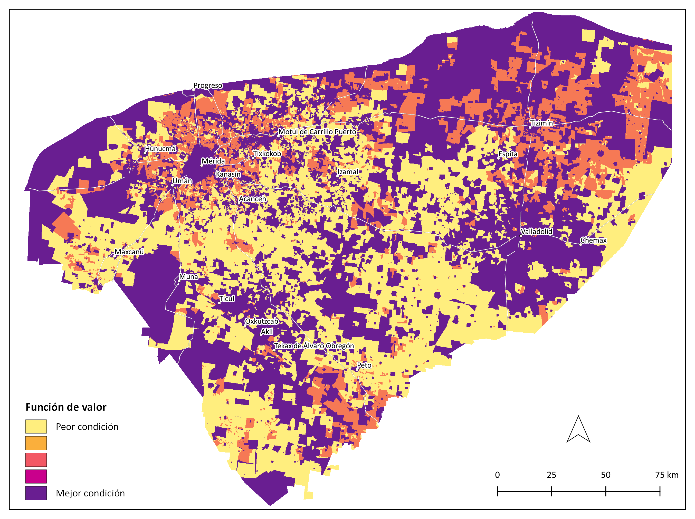

#### 1.2.2 Eólica

Instalaciones de generación de energía, mayores a 0.5 MW.

Atributos | Definición
-- | --
Velocidad | Velocidad del viento en m/s a 120 m de altura, para colocar dispositivos de conversión de energía eólica a eléctrica.
Distancia a red eléctrica | Distancia a líneas de transmisión y subestaciones.
Cobertura | Tipo de vegetación.
Distancia a caminos | Distancia a carreteras.
Distancia a localidades | Distancia de asentamientos humanos a los aerogeneradores, excluye a las localidades.

##### 1.2.2.1 Velocidad

Velocidad del viento en m/s a 120 m de altura, para colocar dispositivos de conversión de energía eólica a eléctrica.

**Insumos**

Capa | Velocidad del viento a 120 metros de altura
-- | --
Fuente | Velocidad de viento a 120 metros de altura (anual) SENER-CFE
Año | 2014
Campo | Velocidad
Escala | 7 km
Unidades | m/s

**Parámetros de la función de valor**

**Función de valor de velocidad**

##### 1.2.2.2 Distancia a red eléctrica

Distancia a líneas de transmisión y subestaciones.

**Insumos**

Capa | Distancia a líneas de transmisión de energía   eléctrica
-- | --
Fuente | Líneas de transmisión en México. GeoComunes con datos de CFE
Año | 2020
Escala | Sin dato
Unidades | Kilómetros

**Parámetros de la función de valor**

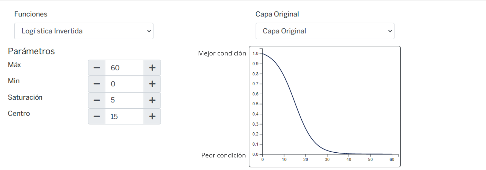

**Función de valor de distancia a red eléctrica**

##### 1.2.2.3 Cobertura

Tipo de vegetación.

**Insumos**

Campo | Uso del suelo y vegetación
-- | --
Fuente | [1] Conjunto de datos vectoriales de la carta de Uso del suelo y vegetación. Serie VI. Conjunto Nacional INEGI y [2] Mapa de uso del suelo y vegetación de la zona costera asociada a los manglares, Región Península de Yucatán CONABIO
Año | [1] 2017; [2] 2021
Campo | [1] descripcio; [2] Descrip
Escala | [1] 1:250,000; [2] 1:50,000
Unidades | Adimensional

**Parámetros de la función de valor**

ID | Cobertura | Importancia | FV
-- | -- | -- | --
2 | Agricultura de riego | Máxima | 1.00
3 | Agricultura de temporal | Máxima | 1.00
5 | Bosque cultivado/Palmar inducido | Máxima | 1.00
8 | Pastizal | Máxima | 1.00
11 | Sin vegetación | Máxima | 1.00
9 | Selva baja | Baja | 0.56
10 | Selva mediana | Baja | 0.56
12 | Sabana | Muy baja | 0.33
15 | Vegetación de petén | Muy baja | 0.33
1 | Acuícola | Nula | 0.00
4 | Asentamiento humano | Nula | 0.00
6 | Cuerpo de agua | Nula | 0.00
7 | Manglar | Nula | 0.00
13 | Tular | Nula | 0.00
14 | Vegetación de duna costera | Nula | 0.00
16 | Vegetación halófila hidrófila | Nula | 0.00
17 | ND | Nula | 0.00

**Función de valor de cobertura**

##### 1.2.2.4 Distancia a caminos

Distancia a carreteras.

**Insumos**

Capa | Distancia a carreteras
-- | --
Fuente | Red Nacional de Caminos (RNC) INEGI
Año | 2019
Escala | Sin dato
Unidades | Kilómetros

**Parámetros de la función de valor**

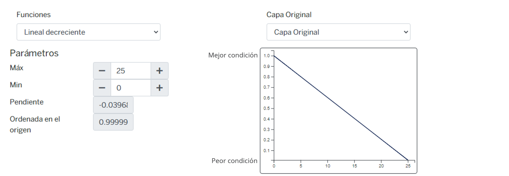

**Función de valor de distancia a carreteras**

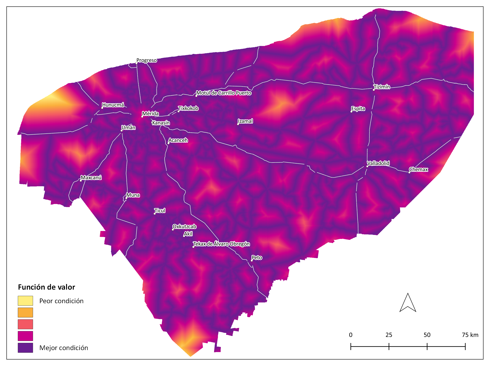

##### 1.2.2.5 Distancia a localidades

Distancia de asentamientos humanos a los aerogeneradores, excluye a las localidades.

**Insumos**

Capa | Distancia a localidades
-- | --
Fuente | Polígonos de localidades. Marco Geoestadístico. Censo de Población y Vivienda INEGI
Año | 2020
Escala | Sin dato
Unidades | Kilómetros

**Parámetros de la función de valor**

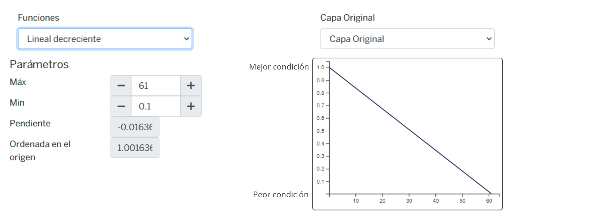

**Función de valor de distancia a localidades**

#### 1.2.3 Biomasa

Proyectos diseñados que utilizan material biológico, para conversion en energía utilizable. Incluye los desechos de granjas porcícolas para producir energía eléctrica.

Atributos | Definición
-- | --
Residuos urbanos | Distancia a los sitios de disposición final de residuos urbanos
Distancia a granjas porcícolas | Distancia a granjas porcícolas
Residuos vegetales | Residuos agrícolas y forestales

##### 1.2.3.1 Residuos urbanos

Distancia a los sitios de disposición final de residuos urbanos.

**Insumos**

Capa | Distancia a sitios de disposición final
-- | --
Fuente | Sitios de disposición final de residuos INEGI-SEMARNAT
Año | 2017
Escala | Sin dato
Unidades | Kilómetros

**Parámetros de la función de valor**

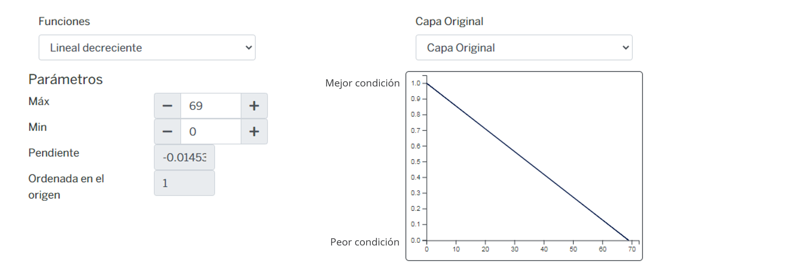   

**Función de valor de residuos urbanos**

##### 1.2.3.2 Distancia a granjas porcícolas

Distancia a granjas porcícolas.

**Insumos**

Capa | Distancia a granjas porcinas
-- | --
Fuente | Granjas porcinas y avícolas en la Península de Yucatán GeoComunes con datos de SAGARPA SIAP
Año | 2019
Escala | Sin dato
Unidades | Kilómetros

**Parámetros de la función de valor**

   

**Función de valor de distancia a granjas porcícolas**

##### 1.2.3.3 Residuos vegetales

Residuos agrícolas y forestales.

**Insumos**

Capa | Residuos agrícolas forestales
-- | --
Fuente | Residuos agrícolas forestales (municipal) SENER-CFE
Año | 2013
Campo | POTENER
Escala | 1:50,000
Unidades | TJ/a

**Parámetros de la función de valor**

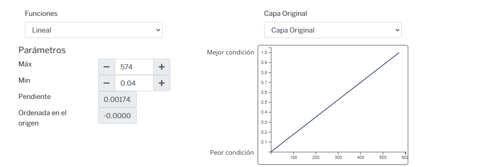

**Función de valor de residuos vegetales**

### 1.3 Mapa de aptitud

#### 1.3.1 Mapa de aptitud de energía solar

##### 1.3.1.1 Zonas de aprovechamiento actual de energía solar

**Insumos**

Capa | Parques solares
-- | --
Fuente | Parques solares en México GeoComunes con datos de coordenadas en MIAs
Año | 2020
Escala | Sin dato
Unidades | Adimensional

##### 1.3.1.2 Zonas de exclusión actual de energía solar

**Insumos**

Campo | Uso del suelo y vegetación
-- | --
Fuente | [1] Conjunto de datos vectoriales de la carta de Uso del suelo y vegetación. Serie VI. Conjunto Nacional INEGI y [2] Mapa de uso del suelo y vegetación de la zona costera asociada a los manglares, Región Península de Yucatán CONABIO
Año | [1] 2017; [2] 2021
Campo | [1] descripcio; [2] Descrip
Escala | [1] 1:250,000; [2] 1:50,000
Unidades | Adimensional

**Tabla de exclusión del sector energía de fuente solar**

ID | Cobertura
-- | --
1 | Acuícola
6 | Cuerpo de agua
7 | Manglar
13 | Tular
14 | Vegetación de duna costera
15 | Vegetación de petén
16 | Vegetación halófila hidrófila
17 | ND

##### 1.3.1.3 Mapa de aptitud de energía solar

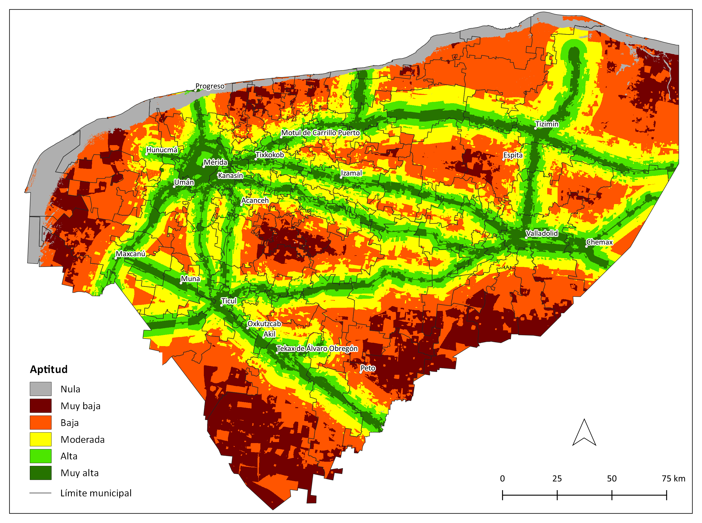

#### 1.3.2 Mapa de aptitud de energía eólica

##### 1.3.2.1 Zonas de aprovechamiento actual de energía eólica

**Insumos**

Capa | Parques eólicos
-- | --
Fuente | Parques eólicos en México GeoComunes con datos de coordenadas en MIAs
Año | 2020
Escala | Sin dato
Unidades | Adimensional

##### 1.3.2.2 Zonas de exclusión actual de energía eólica

**Insumos**

Campo | Uso del suelo y vegetación
-- | --
Fuente | [1] Conjunto de datos vectoriales de la carta de Uso del suelo y vegetación. Serie VI. Conjunto Nacional INEGI y [2] Mapa de uso del suelo y vegetación de la zona costera asociada a los manglares, Región Península de Yucatán CONABIO
Año | [1] 2017; [2] 2021
Campo | [1] descripcio; [2] Descrip
Escala | [1] 1:250,000; [2] 1:50,000
Unidades | Adimensional

**Tabla de exclusión del sector energía de fuente energía eólica**

ID | Cobertura
-- | --
1 | Acuícola
4 | Asentamiento humano
6 | Cuerpo de agua
7 | Manglar
13 | Tular
14 | Vegetación de duna costera
16 | Vegetación halófila hidrófila
17 | ND

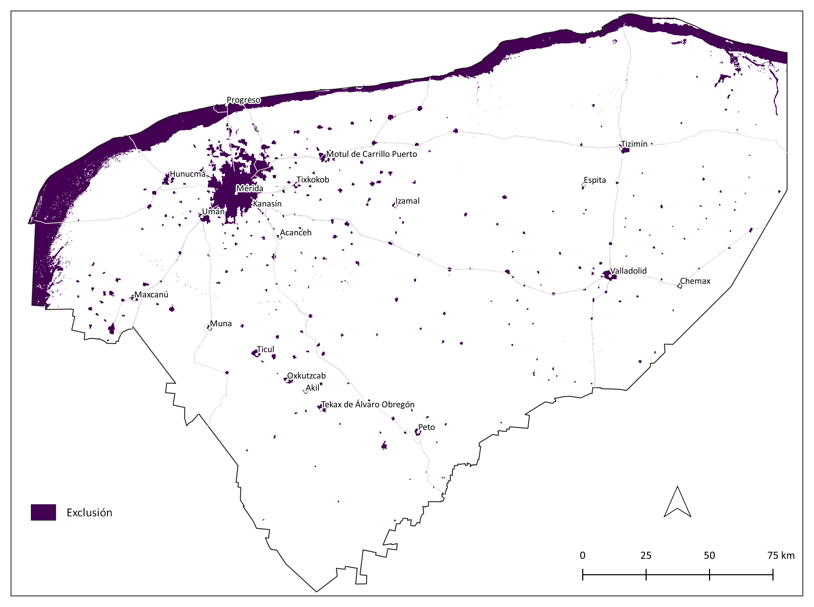

##### 1.3.2.3 Mapa de aptitud de energía eólica

#### 1.3.3 Mapa de aptitud de energía de fuente biomasa

##### 1.3.3.1 Zonas de aprovechamiento actual de energía fuente biomasa

**Insumos**

Capa | Granjas porcinas
-- | --
Fuente | Granjas porcinas y avícolas en la Península de Yucatán GeoComunes con datos de SAGARPA SIAP
Año | 2019
Escala | Sin dato
Unidades | Adimensional

##### 1.3.3.2 Zonas de exclusión actual de energía fuente biomasa

**Insumos**

Campo | Uso del suelo y vegetación
-- | --
Fuente | [1] Conjunto de datos vectoriales de la carta de Uso del suelo y vegetación. Serie VI. Conjunto Nacional INEGI y [2] Mapa de uso del suelo y vegetación de la zona costera asociada a los manglares, Región Península de Yucatán CONABIO
Año | [1] 2017; [2] 2021
Campo | [1] descripcio; [2] Descrip
Escala | [1] 1:250,000; [2] 1:50,000
Unidades | Adimensional

**Tabla de exclusión del sector energía de fuente biomasa**

ID | Cobertura
-- | --
1 | Acuícola
4 | Asentamiento humano
6 | Cuerpo de agua
7 | Manglar
13 | Tular
14 | Vegetación de duna costera
16 | Vegetación halófila hidrófila
17 | ND

##### 1.3.3.3 Mapa de aptitud de energía de fuente biomasa

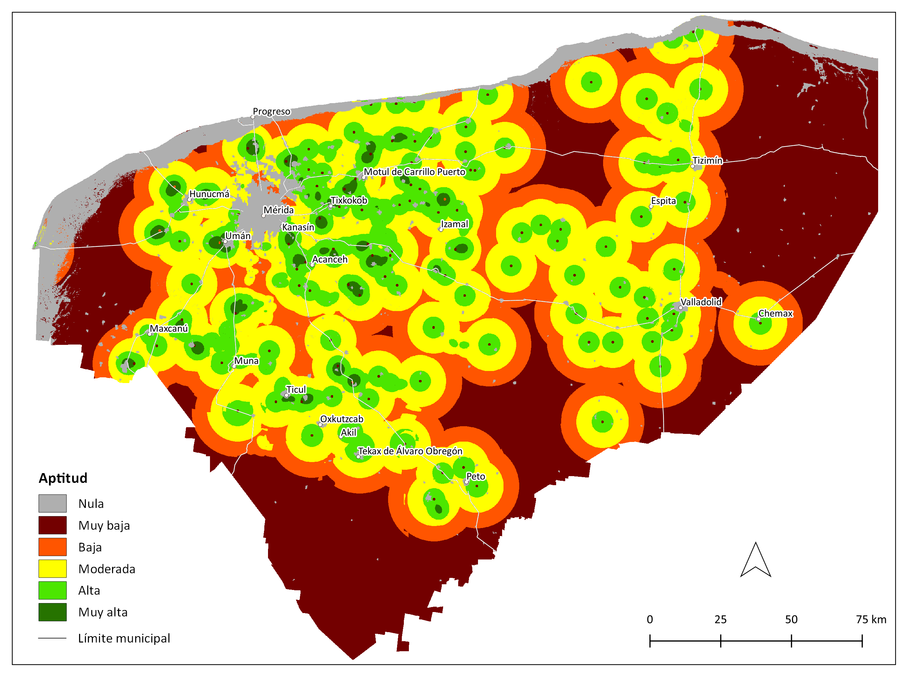

**Con base en los Art. 37 y 38 del Reglamento de la Ley General del Equilibrio Ecológico y la Protección al Ambiente en Materia de Ordenamiento Ecológico el mapa de aptitud que se utilizará como insumo para la actualización del POETY es el de energías renovables que se muestra a continuación.**

#### 2.1.1 Mapa de aptitud de energías renovables

**Pesos globales del mapa de aptitud de energías renovables**

Fuente de energía | Criterio | Peso
-- | -- | --
Solar | Distancia a red eléctrica | 0.399
Eólica | Velocidad  | 0.204
Solar | Cobertura | 0.080
Solar | Tenencia de la tierra | 0.080
Eólica | Distancia a la red eléctrica | 0.074
Biomasa | Residuos urbanos | 0.060
Eólica | Cobertura | 0.046
Biomasa | Distancia a granjas porcícolas | 0.024
Eólica | Distancia a carreteras | 0.014
Eólica | Distancia a localidades | 0.014
Biomasa | Residuos vegetales | 0.005

**Área por categoría de aptitud**

Categoría | km² | Porcentaje del estado
-- | --: | --:
Muy alta | 1786.4 | 5
Alta | 10186.2 | 26
Moderada | 13293.6 | 34
Baja | 9922.8 | 25
Muy baja | 2476.1 | 6
Nula | 1871.4 | 5

#### 2.1.2 Sensibilidad de atributos ambientales de energías renovables

