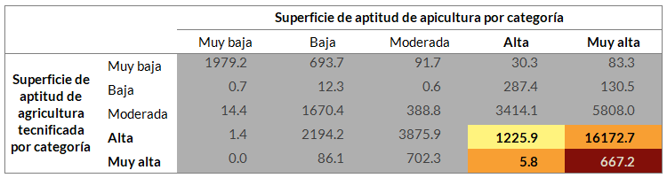

# Introducción

**Análisis de conflictos**

Un producto esencial de la etapa del diagnóstico es la ubicación y descripción de los conflictos ambientales que existen en el área a ordenar. Los conflictos pueden ser directos cuando los sectores tienen interés en desarrollar su actividad en el mismo espacio o en utilizar el mismo recurso natural; son indirectos cuando un sector afecta indirectamente un recurso que requiere otro sector, dificultando o impidiendo el desarrollo de su actividad.

En el análisis de conflictos se examinó cada par de sectores en disputa mediante la sobreposición de sus mapas de aptitud. Como resultado, se obtuvieron las superficies de traslape, siendo de mayor interés aquellas donde coincide la aptitud alta y muy alta de ambos sectores, las cuales se identifican por su tonalidad obscura en el mapa de conflictos. Para ilustrarlo, se toma como ejemplo el conflicto entre los sectores agricultura tecnificada - apicultura.

A partir de las superficies de traslape se elaboraron **tablas de extensión** (km²). Los mayores conflictos ocurren donde coinciden las aptitudes alta y muy alta de ambos sectores, como se aprecia en la siguiente tabla.

Por último, a partir de los valores de las superficies de intersección se calcularon índices que proporcionan información útil para la etapa de propuesta, cuyos resultados se presentan en las **tablas de índices**:

El **índice de severidad regional bruta** representa la proporción del territorio donde coinciden las categorías de aptitud alta y muy alta de dos sectores con actividades incompatibles. Equivale a la extensión de un conflicto ambiental. Su expresión como porcentaje facilita identificar la severidad de los conflictos ambientales: valores altos significan que porciones relativamente grandes del territorio resultan de interés para esos sectores cuyas actividades son incompatibles.

El **índice de severidad regional neta** es la proporción que resulta de la comparación de la forma geográfica de las categorías de aptitud alta y muy alta de dos sectores cuyas actividades son incompatibles. Equivale a la magnitud de un conflicto ambiental.

El **índice de asimetría** del conflicto ambiental indica en qué proporción una categoría de aptitud de un sector está contenida dentro de una categoría de otro sector. Es un proxi del costo de excluir la actividad de uno o de otro de los sectores de un territorio.

# Matriz de conflictos

&nbsp; | Milpa | Apicul | Ac_sal | Pesca | Forest | Tu_nat | Tu_sol | Urbano | Conser
-- | -- | -- | -- | -- | -- | -- | -- | -- | --
**Agricu** | [1](https://lancis-apc.github.io/fomix/agricultura_conflictos.html#agricultura-tecnificada-vs-milpa-maya) | [1](https://lancis-apc.github.io/fomix/agricultura_conflictos.html#agricultura-tecnificada-vs-apicultura) | &nbsp; | &nbsp; | [1](https://lancis-apc.github.io/fomix/agricultura_conflictos.html#agricultura-tecnificada-vs-forestal) | &nbsp; | &nbsp; | &nbsp; | [1](https://lancis-apc.github.io/fomix/agricultura_conflictos.html#agricultura-tecnificada-vs-conservacion)
**Milpa** | &nbsp; | &nbsp; | &nbsp; | &nbsp; | [1](https://lancis-apc.github.io/fomix/milpa_conflictos.html#milpa-maya-vs-forestal) | &nbsp; | &nbsp; | &nbsp; | [1](https://lancis-apc.github.io/fomix/milpa_conflictos.html#milpa-maya-vs-conservacion)
**Bovino** | &nbsp; | [1](https://lancis-apc.github.io/fomix/bovino_conflictos.html#pecuario-bovino-vs-apicola) | &nbsp; | &nbsp; | &nbsp; | &nbsp; | &nbsp; | [1](https://lancis-apc.github.io/fomix/bovino_conflictos.html#pecuario-bovino-vs-urbano) | [1](https://lancis-apc.github.io/fomix/bovino_conflictos.html#pecuario-bovino-vs-conservacion)
**Po_avi** | &nbsp; | &nbsp; | &nbsp; | &nbsp; | &nbsp; | &nbsp; | &nbsp; | [1](https://lancis-apc.github.io/fomix/porcino_conflictos.html#porcino-y-avicola-vs-urbano) | [1](https://lancis-apc.github.io/fomix/porcino_conflictos.html#porcino-y-avicola-vs-conservacion)
**Ac_sal** | &nbsp; | &nbsp; | &nbsp; | &nbsp; | &nbsp; | &nbsp; | &nbsp; | &nbsp; | [1](https://lancis-apc.github.io/fomix/acuacultura_s_conflictos.html#acuacultura-salobre-vs-conservacion)
**Forest** | &nbsp; | &nbsp; | &nbsp; | &nbsp; | &nbsp; | &nbsp; | &nbsp; | &nbsp; | [1](https://lancis-apc.github.io/fomix/forestal_conflictos.html#forestal-vs-conservacion)
**Miner** | &nbsp; | &nbsp; | &nbsp; | &nbsp; | &nbsp; | &nbsp; | &nbsp; | &nbsp; | [1](https://lancis-apc.github.io/fomix/mineria_conflictos.html#mineria-vs-conservacion)
**Energ** | [1](https://lancis-apc.github.io/fomix/energia_conflictos.html#energia-renovable-vs-milpa-maya) | [1](https://lancis-apc.github.io/fomix/energia_conflictos.html#energia-renovable-vs-apicultura) | &nbsp; | &nbsp; | &nbsp; | &nbsp; | &nbsp; | &nbsp; | [1](https://lancis-apc.github.io/fomix/energia_conflictos.html#energia-renovable-vs-conservacion)
**Indust** | &nbsp; | &nbsp; | &nbsp; | &nbsp; | [1](https://lancis-apc.github.io/fomix/industrial_conflictos.html#industrial-vs-forestal) | &nbsp; | &nbsp; | &nbsp; | [1](https://lancis-apc.github.io/fomix/industrial_conflictos.html#industrial-vs-conservacion)
**Tu_nat** | &nbsp; | &nbsp; | &nbsp; | &nbsp; | &nbsp; | &nbsp; | &nbsp; | &nbsp; | [1](https://lancis-apc.github.io/fomix/turismo_conflictos.html#turismo-de-naturaleza-vs-conservacion)
**Tu_sol** | &nbsp; | &nbsp; | [1](https://lancis-apc.github.io/fomix/turismo_sol_playa_conflictos.html#turismo-de-sol-y-playa-vs-acuacultura-salobre) | [1](https://lancis-apc.github.io/fomix/turismo_sol_playa_conflictos.html#turismo-de-sol-y-playa-vs-pesca) | &nbsp; | [1](https://lancis-apc.github.io/fomix/turismo_sol_playa_conflictos.html#turismo-de-sol-y-playa-vs-turismo-de-naturaleza) | &nbsp; | &nbsp; | [1](https://lancis-apc.github.io/fomix/turismo_sol_playa_conflictos.html#turismo-de-sol-y-playa-vs-conservacion)
**Urbano** | &nbsp; | &nbsp; | &nbsp; | &nbsp; | &nbsp; | [1](https://lancis-apc.github.io/fomix/urbano_conflictos.html#urbano-vs-turismo-de-naturaleza) | [1](https://lancis-apc.github.io/fomix/urbano_conflictos.html#urbano-vs-turismo-de-sol-y-playa) | &nbsp; | [1](https://lancis-apc.github.io/fomix/urbano_conflictos.html#urbano-vs-conservacion)
**Conser** | &nbsp; | &nbsp; | [1](https://lancis-apc.github.io/fomix/conservacion_conflictos.html#conservacion-vs-acuacultura-salobre) | &nbsp; | &nbsp; | &nbsp; | &nbsp; | &nbsp; | &nbsp;

Ac_sal = acuacultura salobre, Agricu= agricultura tecnificada, Apicul = apicultura, Bovino = pecuario bovino, Conser = conservación, Energ = Enería, Forest = forestal, Indust = industrial, Milpa = milpa maya, Miner = Minería, Po_avi = pecuario porcícola y avícola, Tu_nat = turismo de naturaleza, Tu_sol = turismo de sol y playa.
