# Pesca

<!-- Ruta de la documentación:
FOMIX\fmx_estudio_tecnico\diagnostico\talleres\sphinx\docs -->

## Meta

* Fortalecer el sector pesquero para que desarrolle actividades pesqueras viables y sostenibles.
* Fortalecer la infraestructura de procesamiento actual en la zona costera y áreas circundantes, así como buscar espacios para el desarrollo de centros de acopio y plantas de procesamiento de subproductos de la pesca, que cumplan con la normatividad nacional e internacional.
* Asegurar espacios de refugio para embarcaciones pesqueras y definir espacios diferenciados para las embarcaciones de desarrollo turístico y pesca comercial.

[Lista de participantes](https://www.dropbox.com/s/e44gv4no0lrbcjb/lista_asistencia_pesca.pdf?dl=0)

## 1. Pesca

### 1.1 Modelo de decisión

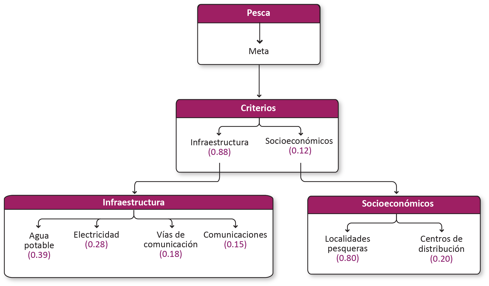

Debido a que la actividad pesquera en el estado es marina, el análisis se aplicó en la zona que abarca 100 km a partir de la línea de costa.

### 1.2 Criterios

#### 1.2.1 Infraestructura

Criterio|Definición
--|--
Agua potable| Acceso a agua potable para la producción de hielo como distancia de 5 km a localidades urbanas y pesqueras evaluadas con base en el porcentaje de viviendas que disponen de agua entubada.
Electricidad| Distancia a red de transmisión eléctrica.
Vías de comunicación| Distancia a caminos y carreteras para el transporte de insumos y productos.
Comunicaciones| Acceso a comunicación a través de internet y telefonía.

##### 1.2.1.1 Agua potable

Acceso a agua potable para la producción de hielo como distancia de 5 km a localidades urbanas y pesqueras evaluadas con base en el porcentaje de viviendas que disponen de agua entubada.

**Insumos**

Capa | Viviendas que disponen de agua entubada por localidad
-- | --
Fuente | [1] Polígonos de localidades urbanas y pesqueras. Marco Geoestadístico. Censo de Población y Vivienda INEGI y [2] Datos de indicador. Censo de Población y Vivienda.   Principales resultados por localidad (ITER) INEGI
Año | 2020
Campo | [2] VIVTOT y VPH_AEASP
Unidades | Porcentaje

**Parámetros de la función de valor**

**Función de valor de agua potable**

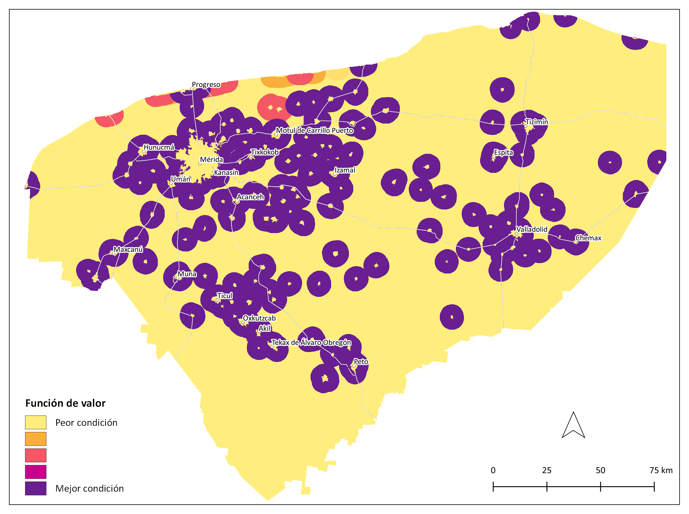

##### 1.2.1.2 Electricidad

Distancia a red de transmisión eléctrica.

**Insumos**

Capa | Distancia líneas de transmisión de energía   eléctrica
-- | --
Fuente | Líneas de transmisión INEGI
Año | 2012
Escala | 1:50,000
Unidades | Kilómetros

**Parámetros de la función de valor**

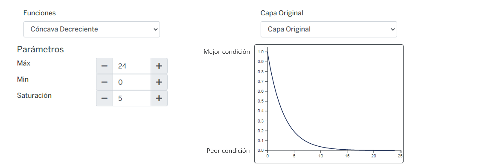

**Función de valor de electricidad**

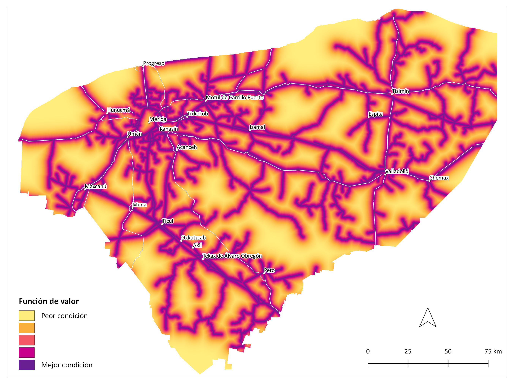

##### 1.2.1.3 Vías de comunicación

Distancia a caminos y carreteras para el transporte de insumos y productos.

**Insumos**

Capa | Distancia a la red vial
-- | --
Fuente | Red Nacional de Caminos (RNC) Red vial - INEGI
Año | 2019
Escala | Sin dato
Unidades | Kilómetros

**Parámetros de la función de valor**

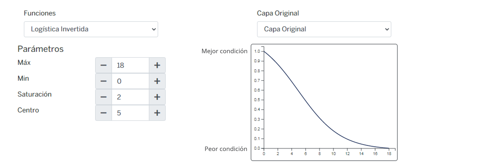

**Función de valor de vías de comunicación**

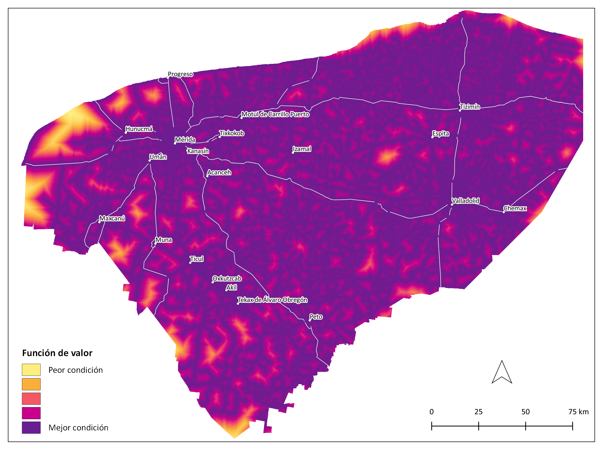

##### 1.2.1.4 Comunicaciones

Acceso a comunicación a través de internet y telefonía.

Criterio|Definición
--|--
Internet| Distancia de 5 km a localidades urbanas y pesqueras evaluadas con base en el porcentaje de viviendas con internet.
Telefonía| Distancia de 5 km a localidades urbanas y pesqueras evaluadas con base en el porcentaje de viviendas con celular.

###### 1.2.1.4.1 Internet

Distancia de 5 km a localidades urbanas y pesqueras evaluadas con base en el porcentaje de viviendas con internet.

**Insumos**

Capa | Viviendas con internet por localidad
-- | --
Fuente | [1] Polígonos de localidades urbanas y pesqueras. Marco Geoestadístico. Censo de Población y Vivienda INEGI y [2] Datos de indicador. Censo de Población y Vivienda.   Principales resultados por localidad (ITER) INEGI
Año | 2020
Campo | [2] VIVTOT y VPH_INTER
Unidades | Porcentaje

**Parámetros de la función de valor**

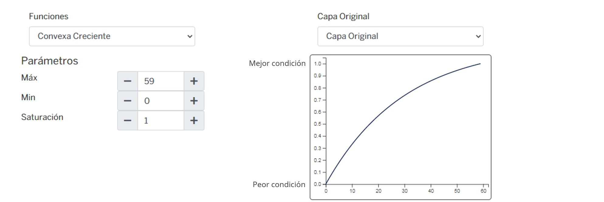

**Función de valor de internet**

###### 1.2.1.4.2 Telefonía

Distancia de 5 km a localidades urbanas y pesqueras evaluadas con base en el porcentaje de viviendas con celular.

**Insumos**

Capa | Viviendas que disponen de teléfono celular por localidad
-- | --
Fuente | [1] Polígonos de localidades urbanas y pesqueras. Marco Geoestadístico. Censo de Población y Vivienda INEGI y [2] Datos de indicador. Censo de Población y Vivienda.   Principales resultados por localidad (ITER) INEGI
Año | 2020
Campo | [2] VIVTOT y VPH_CEL
Unidades | Porcentaje

**Parámetros de la función de valor**

**Función de valor de telefonía**

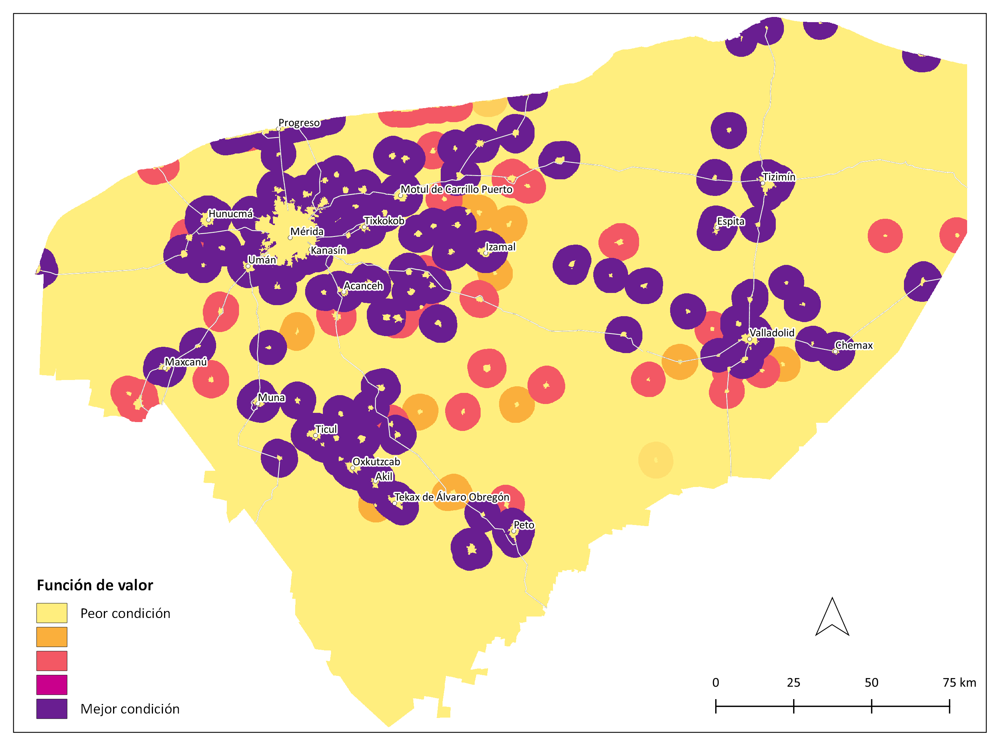

#### 1.2.2 Socioeconómicos

Criterio|Definición
--|--
Localidades pesqueras| Distancia a localidades con comunidades pesqueras: Celestún, Sisal, Chuburná, Yucalpetén, Progreso, Telchac, Chabihau, Dzilam de Bravo, San Felipe, Río Lagartos, Las Coloradas, El Cuyo, Chelem, Chicxulub, Santa Clara y San Crisanto.
Centros de distribución| Distancia a localidades consideradas como puntos de distribución de productos pesqueros: Progreso, Mérida, Valladolid, Tizimín, Hunucmá, Motul y Dzilam González.

##### 1.2.2.1 Localidades pesqueras

Distancia a localidades con comunidades pesqueras: Celestún, Sisal, Chuburná, Yucalpetén, Progreso, Telchac, Chabihau, Dzilam de Bravo, San Felipe, Río Lagartos, Las Coloradas, El Cuyo, Chelem, Chicxulub, Santa Clara y San Crisanto.

**Insumos**

Capa | Distancia a localidades pesqueras
-- | --
Fuente | Polígonos de localidades. Marco Geoestadístico. Censo de Población y   Vivienda INEGI
Año | 2020
Escala | Sin dato
Unidades | Kilómetros

**Parámetros de la función de valor**

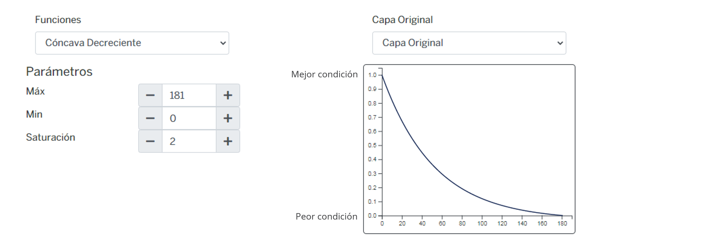

**Función de valor de localidades pesqueras**

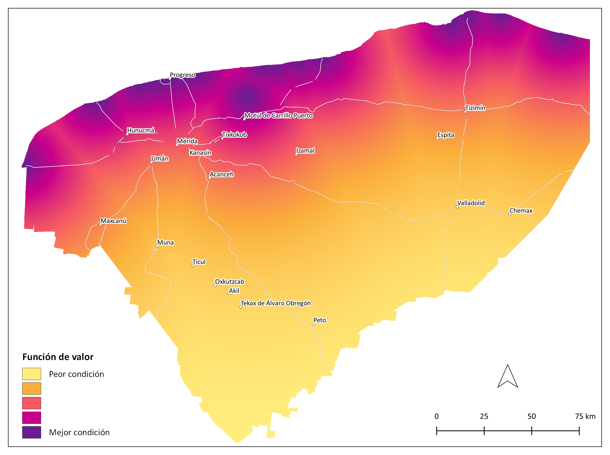

##### 1.2.2.2 Centros de distribución

Distancia a localidades consideradas como puntos de distribución de productos pesqueros: Progreso, Mérida, Valladolid, Tizimín, Hunucmá, Motul y Dzilam González.

**Insumos**

Capa | Distancia a localidades con centros de distribución de productos pesqueros
-- | --
Fuente | Polígonos de localidades. Marco Geoestadístico. Censo de Población y   Vivienda INEGI
Año | 2020
Escala | Sin dato
Unidades | Kilómetros

**Parámetros de la función de valor**

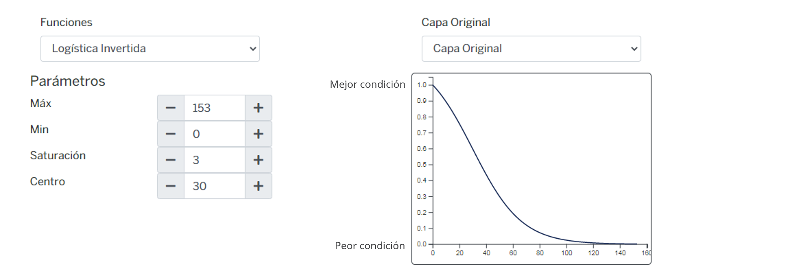

**Función de valor de centros de distribución**

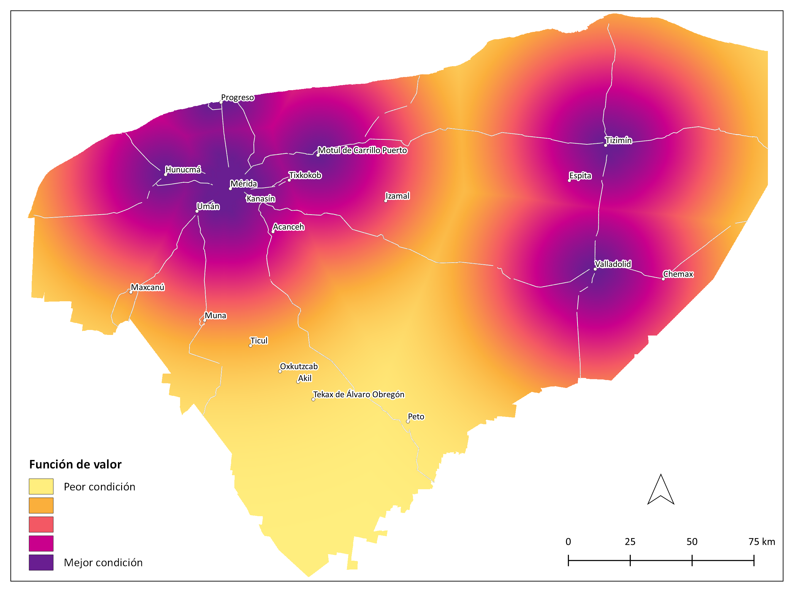

### 1.3 Mapa de aptitud

#### 1.3.1 Zonas de exclusión

Se considera como exclusión la distancia mayor a 100 km a partir de la línea de costa.

**Insumos**

Capa | Distancia a la línea de costa
-- | --
Fuente | Adaptado de: División política municipal INEGI
Año | 2018
Escala | 1:250,000
Unidades | Kilómetros

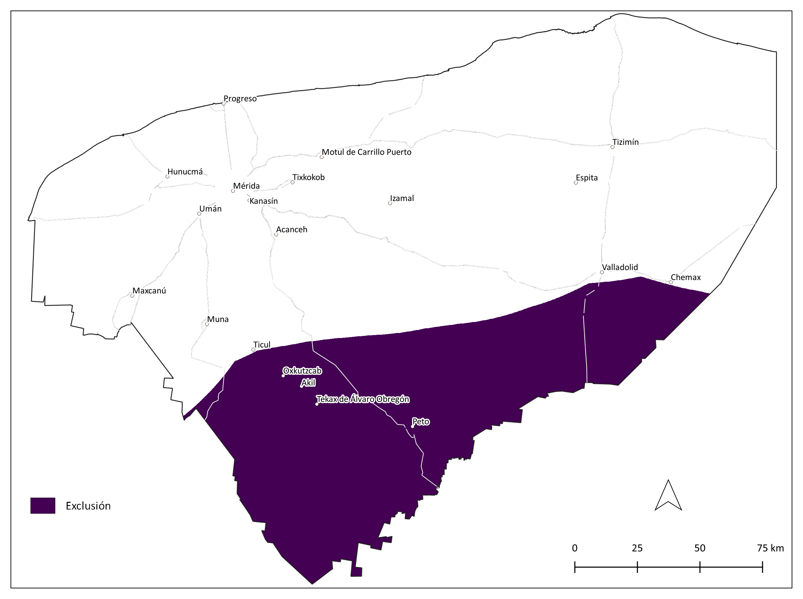

#### 1.3.2 Mapa de aptitud de pesca

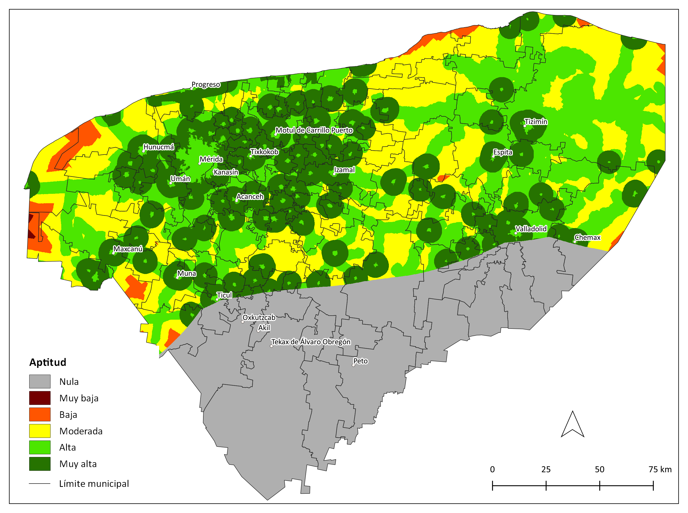

**Pesos globales de los atributos ambientales de pesca**

Criterio | Peso
-- | --
Agua potable | 0.344
Electricidad | 0.241
Vías de comunicación | 0.155
Centros de distribución | 0.096
Internet | 0.088
Telefonía | 0.046
Localidades pesqueras | 0.024

**Área por categoría de aptitud**

Categoría | km² | Porcentaje del estado
-- | --: | --:
Muy alta | 9874.9 | 25
Alta | 9941.1 | 25
Moderada | 8238.3 | 21
Baja | 729.6 | 2
Muy baja | 14.7 | 0
Nula | 10738.1 | 27

#### 1.3.7 Sensibilidad de atributos ambientales del sector pesca

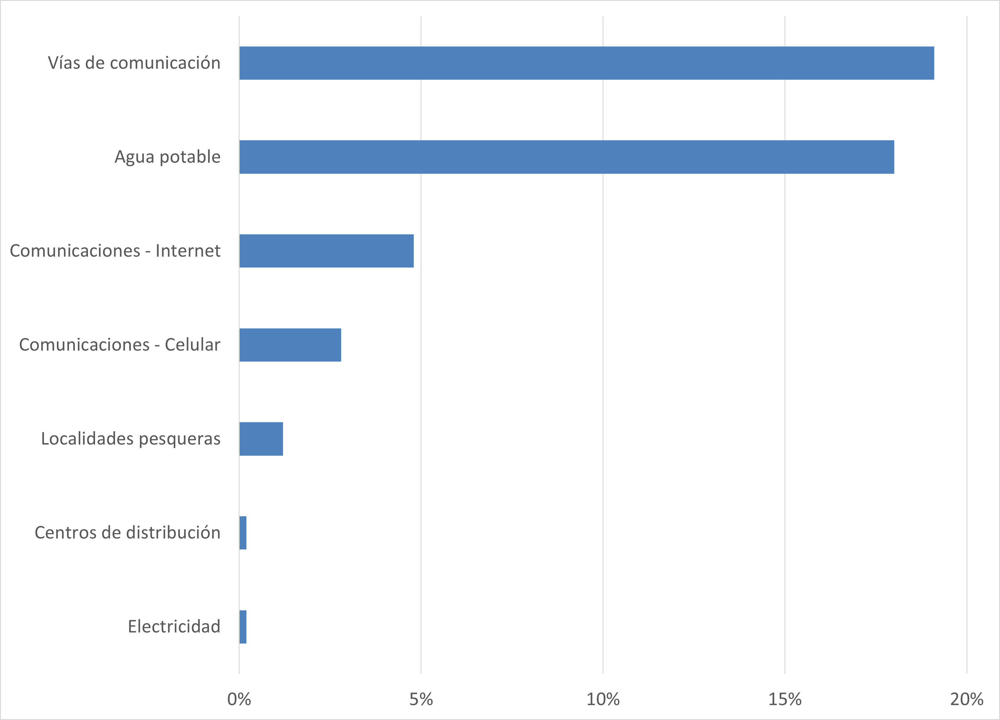
