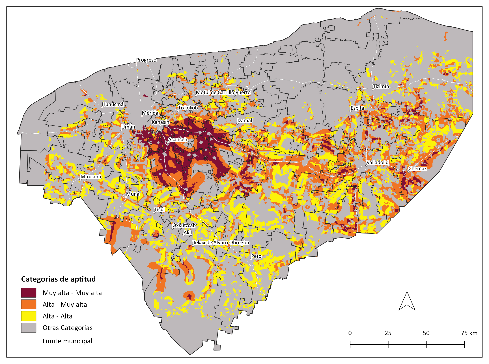
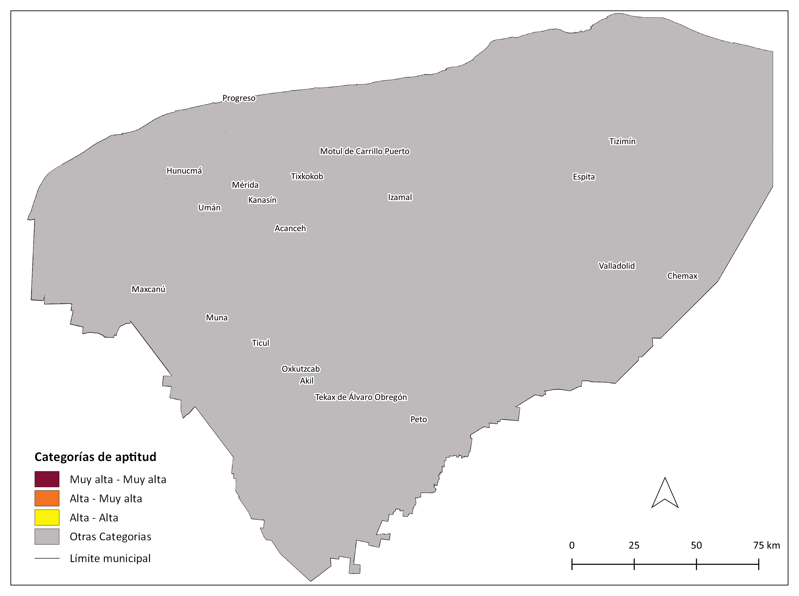

# Pecuario porcino y avícola

## Porcino y avícola **vs.** Conservación

### Descripción del conflicto

- Contaminación de cenotes, acuífero y lagunas costeras por la descarga de desechos de las granjas sin tratamiento.
- Contaminación de acuífero por uso de herbicidas e insecticidas en potreros.
- Intrusión salina por extracción de agua para uso pecuario.
- Escasez de agua por extracción de agua para uso pecuario.

#### Recursos afectados

* Agua, aire.

#### Ubicación reportada

- Municipios: Abalá, Acanceh, Cacalchén, Conkal, Homún, Hunucmá, Kanasín, Muxupip, Tekantó, Tizimín.
- Regiones: Noroeste.
- Reserva Estatal Geohidrológica del Anillo de Cenotes y Punta Laguna.

#### Fuentes

- Batllori, 2019, García de Fuentes et al. 2019, OCDE 2019, Batllori 2016, FAO-SEDER-Gobierno de Yucatán 2016, Novelo et al. 2009, Drucker et al. 2003.
- Taller pecuario porcino y avícola.
- Clave de registro en encuesta de conflictos ambientales: F7, F13, F14, F31, F45 y F46.

### Superficie de conflicto por categorías de aptitud (km²)

### Mapa de conflictos

Los conflictos ambientales resultan de la sopreposición de las categorías Alta y Muy alta de aptitud de los dos sectores incompatibles.

### Índices de conflictos ambientales

Los índices indican la severidad del conflicto y pueden tener valores entre 0 y 1.

## Porcino y avícola **vs.** Urbano

### Descripción del conflicto

- Contaminación del aire y malos olores generados por los desechos de las granjas porcícolas (emi-siones de amoniaco, sulfuros de hidrógeno metano y dióxido de carbono).

#### Recursos afectados

* Aire.

#### Ubicación reportada

- Sin dato.

#### Fuentes

- Batllori 2019, Drucker et al. 2003.
- Taller pecuario porcino y avícola.
- Clave de registro en encuesta de conflictos ambientales: F3 y F9
es: F7, F13, F14, F31, F45 y F46.

### Superficie de conflicto por categorías de aptitud (km²)

### Mapa de conflictos

Los conflictos ambientales resultan de la sopreposición de las categorías Alta y Muy alta de aptitud de los dos sectores incompatibles.

### Índices de conflictos ambientales

Los índices indican la severidad del conflicto y pueden tener valores entre 0 y 1.

