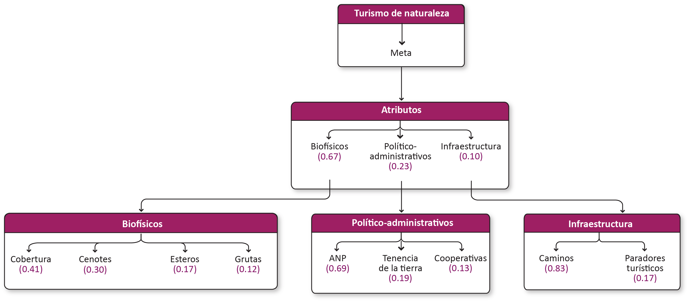
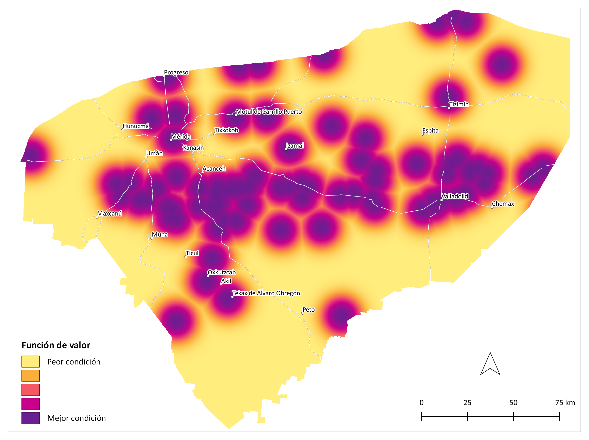
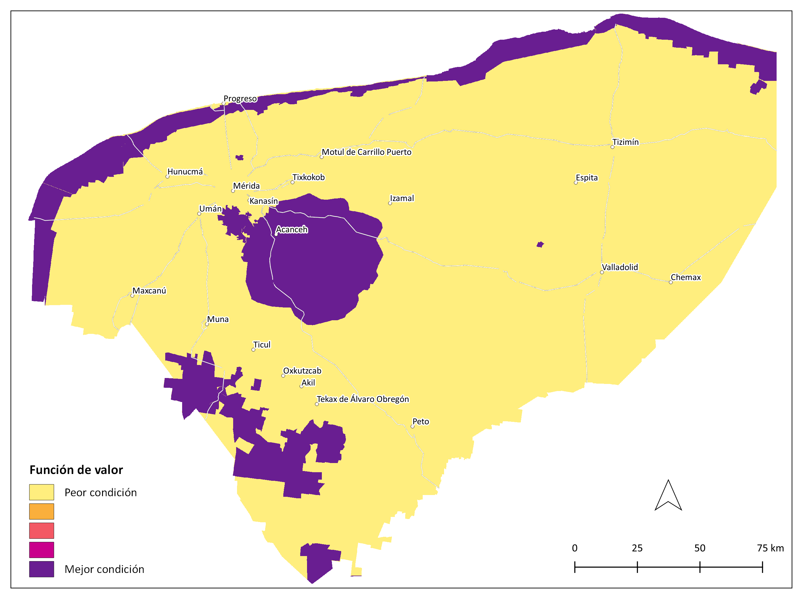
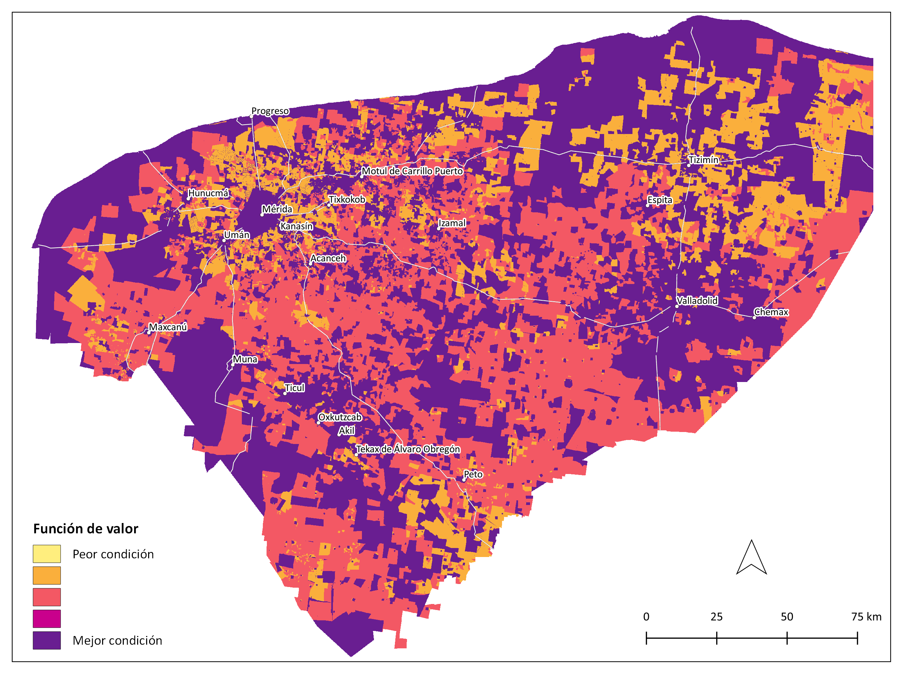
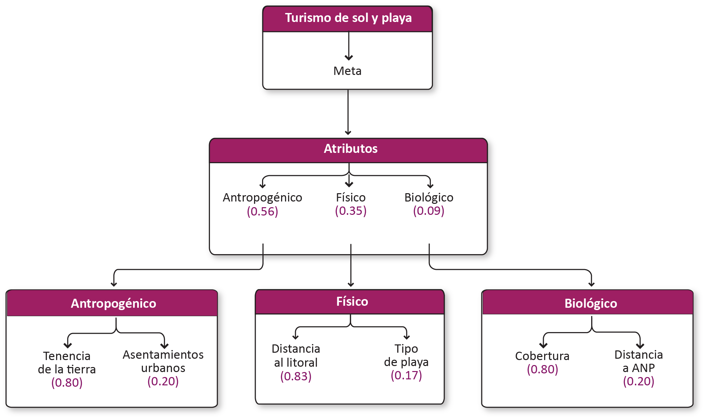

# Turismo-Final

<!-- Ruta de la documentación:
FOMIX\fmx_estudio_tecnico\diagnostico\talleres\sphinx\docs -->

## Meta

Desarrollar y promocionar un modelo de turismo sustentable y diversificado, que oferte un balance entre el turismo tradicional y el turismo comunitario-rural y biocultural.

[Lista de participantes](https://www.dropbox.com/s/945471sskil5wbd/lista_asistencia_turismo.pdf?dl=0)

## 1. Turismo de naturaleza y de sol y playa

### 1.1 Turismo de naturaleza

Viajes para realizar actividades recreativas en contacto directo con la naturaleza. Incluye turismo de aventura, ecoturismo, aviturismo, turismo comunitario.

### 1.2 Modelo de decisión

#### 1.2.1 Atributos de turismo de naturaleza

Atributos | Definición
-- | --
Biofísicos | Elementos o formaciones geológicas con características únicas que satisfacen necesidades de recreación y esparcimiento.
Político-administrativo | Atributos administrativos y de gestión relacionados con el turismo de naturaleza.
Infraestructura | Atributos de infraestructura asociados al turismo de naturaleza.

##### 1.2.1.1 Biofísicos

Elementos o formaciones geológicas con características únicas que satisfacen necesidades de recreación y esparcimiento.

Atributos | Definición
-- | --
Cobertura | Tipo de vegetación y uso de suelo asociado al turismo de   naturaleza.
Cenotes | Distancia a cenotes con potencial turístico.
Esteros | Distancia a cuerpos de agua costeros distintos a los cenotes (lagunas costeras, marismas y esteros).
Grutas | Presencia de grutas con   potencial turístico (cavidad que se forma en las rocas por procesos erosivos,   principalmente por disolución causada por el agua de lluvia que se filtra   entre rocas calcáreas y las disuelve).

###### 1.2.1.1.1 Cobertura

Tipo de vegetación y uso de suelo asociado al turismo de naturaleza.

**Insumos**

Campo | Uso del suelo y vegetación
-- | --
Fuente | [1] Conjunto de datos vectoriales de la carta de Uso del suelo y vegetación. Serie VI. Conjunto Nacional INEGI y [2] Mapa de uso del suelo y vegetación de la zona costera asociada a los manglares, Región Península de Yucatán CONABIO
Año | [1] 2017; [2] 2021
Campo | [1] descripcio; [2] Descrip
Escala | [1] 1:250,000; [2] 1:50,000
Unidades | Adimensional

**Parámetros de la función de valor**

ID | Categoría | Importancia | FV
-- | -- | -- | --
7 | Manglar | Muy alta | 1.00
10 | Selva mediana | Muy alta | 1.00
13 | Tular | Muy alta | 1.00
15 | Vegetación de petén | Muy alta | 1.00
16 | Vegetación halófila hidrófila | Muy alta | 1.00
9 | Selva baja | Alta | 0.75
14 | Vegetación de duna costera | Alta | 0.75
3 | Agricultura de temporal | Moderada | 0.50
2 | Agricultura de riego | Baja | 0.25
4 | Asentamiento humano | Baja | 0.25
5 | Bosque cultivado/Palmar inducido | Baja | 0.25
8 | Pastizal | Baja | 0.25
12 | Sabana | Baja | 0.25
1 | Acuícola | Nula | 0.00
6 | Cuerpo de agua | Nula | 0.00
11 | Sin vegetación | Nula | 0.00
17 | ND | Nula | 0.00

**Función de valor de cobertura**

###### 1.2.1.1.2 Cenotes

Distancia a cenotes con potencial turístico.

**Insumos**

Capa | Cenotes turísticos
-- | --
Fuente | Cenotes con potencial turístico SEDUMA
Año | 2008
Escala | Sin dato
Unidades | Kilómetros

**Parámetros de la función de valor**

**Función de valor de cenotes**

###### 1.2.1.1.3 Esteros

Distancia a cuerpos de agua costeros distintos a los cenotes (lagunas costeras, marismas y esteros).

**Insumos**

Capa | Lagunas costeras, esteros y marismas
-- | --
Fuente | Modelo cartográfico de humedales INEGI
Año | 2014
Campo | SUBCLASE
Escala | 1:50,000
Unidades | Kilómetros

**Parámetros de la función de valor**

**Función de valor de esteros**

###### 1.2.1.1.4 Grutas

Presencia de grutas con potencial turístico (cavidad que se forma en las rocas por procesos erosivos, principalmente por disolución causada por el agua de lluvia que se filtra entre rocas calcáreas y las disuelve).

**Insumos**

Capa | Grutas
-- | --
Fuente | Cenotes y Grutas con infraestructura turística y posicionamiento   satelital&nbsp; SEDUMA
Año | Sin dato
Campo | GRUTAS
Escala | 1:1,000
Unidades | Adimensional

**Función de valor de grutas**

##### 1.2.1.2 Político-administrativo

Atributos administrativos y de gestión relacionados con el turismo de naturaleza.

Atributos | Definición
-- | --
ANP | Presencia de áreas naturales   protegidas de competencia federal, estatal o municipal que influyen en el   turismo de naturaleza.
Tenencia de la tierra | Tipo de tenencia de la tierra:   Áreas ejidales (comunitaria o parcelada) y no ejidales asociados a turismo de   naturaleza.
Cooperativas | Número de cooperativas que   ofrecen servicios de turismo de naturaleza.

###### 1.2.1.2.1 ANP

Presencia de áreas naturales protegidas de competencia federal, estatal o municipal que influyen en el turismo de naturaleza.

**Insumos**

Capa | Áreas Naturales Protegidas
-- | --
Fuente | [1] Áreas Naturales Protegidas SDS con datos de los decretos de las ANPs   estatales, [2] Áreas Naturales Protegidas Federales de la República Mexicana   CONANP y [3] Áreas Naturales   Protegidas Estatales, Municipales, Ejidales y Privadas de México CONABIO
Año | [1] 2020; [2] 2017; [3] 2015
Escala | [1] 1:50,000; [2] [3] Sin dato
Unidades | Adimensional

**Función de valor de ANP**

###### 1.2.1.2.2 Tenencia de la tierra

Tipo de tenencia de la tierra: Áreas ejidales (comunitaria o parcelada) y no ejidales asociados a turismo de naturaleza.

**Insumos**

Capa | Tenencia de la tierra
-- | --
Fuente | [1] Zonas de Tierras Parceladas RAN y [2] Tierra de uso común RAN
Año | 2020
Escala | Sin dato
Unidades | Adimensional

**Parámetros de la función de valor**

ID | Categoría | Importancia | FV
-- | -- | -- | --
3 | No ejidal | Muy alta | 1.00
1 | Tierra de uso común | Moderada | 0.50
2 | Zona de tierras parceladas | Baja | 0.25

**Función de valor de tenencia de la tierra**

###### 1.2.1.2.3 Cooperativas

Número de cooperativas que ofrecen servicios de turismo de naturaleza.

**Insumos**

Capa | Cooperativas
-- | --
Fuente | [1] Polígonos de localidades. Marco Geoestadístico. Censo de Población y   Vivienda INEGI; [2] Datos de indicador. Productos de turismo alternativo en   Yucatán
Año | [1] 2020; [2] ?
Escala | Localidad
Unidades | Número

**Parámetros de la función de valor**

**Función de valor de cooperativas**

##### 1.2.1.3 Infraestructura

Atributos de infraestructura asociados al turismo de naturaleza.

Atributos | Definición
-- | --
Caminos | Presencia de caminos, brechas, terracerías
Paradores   turísticos | Presencia de paradores (lugares que ofrecen instalaciones, servicios y posibilidades para que los turistas   disfruten su experiencia al máximo).

###### 1.2.1.3.1 Caminos

Presencia de caminos, brechas, terracerías.

**Insumos**

Capa | Caminos y veredas
-- | --
Fuente | Red Nacional de Caminos (RNC) Red vial - INEGI
Año | 2019
Campo | TIPO_VIAL
Escala | Sin dato
Unidades | Adimensional

**Función de valor de caminos**

###### 1.2.1.3.2 Paradores turísticos

Presencia de paradores (lugares que ofrecen instalaciones, servicios y posibilidades para que los turistas disfruten su experiencia al máximo).  

**Insumos**

Capa | Paradores turísticos
-- | --
Fuente | Paradores turísticos SEFOTUR
Año | Sin dato
Escala | Sin dato
Unidades | Adimensional

**Función de valor de paradores turísticos**

### 1.3 Mapa de aptitud

#### 1.3.1 Zonas de exclusión

**Insumos**

Capa | Localidades urbanas
-- | --
Fuente | Polígonos de localidades. Marco Geoestadístico. Censo de Población y Vivienda INEGI
Año | 2020
Escala | Localidad
Unidades | Adimensional

#### 1.3.2 Mapa de aptitud de turismo de naturaleza

**Pesos globales de los atributos de turismo de naturaleza**

Criterio | Peso
-- | --
Cobertura | 0.274
Cenotes | 0.201
ANP | 0.160
Esteros | 0.118
Caminos | 0.083
Grutas | 0.080
Tenencia de la tierra | 0.041
Cooperativas | 0.026
Paradores turísticos | 0.017

**Área por categoría de aptitud**

Categoría | km² | Porcentaje del   estado
-- | --: | --:
Muy alta | 1111.7 | 3
Alta | 5531.4 | 14
Moderada | 14211.0 | 36
Baja | 12186.3 | 31
Muy baja | 5512.7 | 14
Nula | 983.6 | 2

#### 1.3.3 Sensibilidad de atributos ambientales de turismo de naturaleza

### 1.4 Turismo de sol y playa

Turismo de sol y playa y segundas residencias.

### 1.5 Modelo de decisión

#### 1.5.1 Atributos de turismo de sol y playa

Atributos | Definición  
-- | --
Antropogénico | Atributos que describen las características antropogénicas del territorio.
Físico | Atributos asociados a las propiedades físicas del suelo y del ambiente.
Biológico | Atributos asociados a las propiedades biológicas del ambiente.

##### 1.5.1.1 Antropogénico

Atributos que describen las características antropogénicas del territorio.

Atributos | Definición
-- | --
Tenencia de la tierra | Áreas ejidales (comunitaria o parcelada) y   no ejidales vinculadas al turismo de sol y playa.
Asentamientos urbanos | Distancia a localidades urbanas   (>= 15,000 habitantes), vía carreteras como indicador del tiempo de   traslado.

###### 1.5.1.1.1 Tenencia de la tierra

Áreas ejidales (comunitaria o parcelada) y no ejidales vinculadas al turismo de sol y playa.

**Insumos**

Capa | Tenencia de la tierra
-- | --
Fuente | [1] Zonas de Tierras Parceladas RAN y [2] Tierra de uso común RAN
Año | 2020
Escala | Sin dato
Unidades | Adimensional

**Parámetros de la función de valor**

ID | Categoría | Importancia | FV
-- | -- | -- | --
3 | No ejidal | Muy alta | 1.00
1 | Tierra de uso común | Alta | 0.75
2 | Zona de tierras parceladas | Moderada | 0.50

**Función de valor de tenencia de la tierra**

###### 1.5.1.1.2 Asentamientos urbanos

Distancia a localidades urbanas (>= 15,000 habitantes), vía carreteras como indicador del tiempo de traslado.

**Insumos**

Capa | Distancia a localidades urbanas
-- | --
Fuente | [1] Polígonos de localidades. Marco Geoestadístico. Censo de Población y   Vivienda INEGI y [2] Red Nacional de Caminos (RNC) Red vial - INEGI
Año | [1] 2020; [2] 2019
Campo | [1] AMBITO; [2] TIPO_VIAL
Escala | 1:250,000
Unidades | Kilómetros

**Parámetros de la función de valor**

**Función de valor de asentamientos urbanos**

##### 1.5.1.2 Físico

Atributos asociados a las propiedades físicas del suelo y del ambiente.

Atributos | Definición
-- | --
Distancia al litoral | Distancia a zona costera
Tipo de playa | Tipo de playa, de acuerdo al sustrato (arenoso, artificial, lodoso, vegetado).

###### 1.5.1.2.1 Distancia al litoral

Distancia a zona costera.

**Insumos**

Capa | Distancia al litoral
-- | --
Fuente | Tipo de litoral POETCY con datos de INEGI y SEMARNAT
Año | 2008
Escala | 1:500,000
Unidades | Kilómetros

**Parámetros de la función de valor**

**Función de valor de distancia al litoral**

###### 1.5.1.2.2 Tipo de playa

Tipo de playa, de acuerdo al sustrato (arenoso, artificial, lodoso, vegetado).

**Insumos**

Capa | Tipo de litoral
-- | --
Fuente | Tipo de litoral POETCY con datos de INEGI y SEMARNAT
Año | 2008
Campo | TIPO
Escala | 1:500,000
Unidades | Adimensional

**Parámetros de la función de valor**

ID | Categoría | Importancia | FV
-- | -- | -- | --
1 | ARENOSO | Muy alta | 1.00
4 | VEGETADO | Alta | 0.75
2 | ARTIFICIAL | Moderada | 0.50
3 | LODOSO | Moderada | 0.50
5 | NA | Nula | 0.00

**Función de valor de tipo de playa**

##### 1.5.1.3 Biológico

Atributos asociados a las propiedades biológicas del ambiente.

Atributos | Definición   
-- | --
Cobertura | Tipo de vegetación y uso del   suelo que contribuye al turismo de sol y playa.
Distancia a ANP | Distancia a áreas naturales protegidas costeras que influyen en el turismo de sol y playa.

###### 1.5.1.3.1 Cobertura

Tipo de vegetación y uso del suelo que contribuye al turismo de sol y playa.

**Insumos**

Campo | Uso del suelo y vegetación
-- | --
Fuente | [1] Conjunto de datos vectoriales de la carta de Uso del suelo y vegetación. Serie VI. Conjunto Nacional INEGI y [2] Mapa de uso del suelo y vegetación de la zona costera asociada a los manglares, Región Península de Yucatán CONABIO
Año | [1] 2017; [2] 2021
Campo | [1] descripcio; [2] Descrip
Escala | [1] 1:250,000; [2] 1:50,000
Unidades | Adimensional

**Parámetros de la función de valor**

ID | Categoría | Importancia | FV
-- | -- | -- | --
14 | Vegetación de duna costera | Muy alta | 1.00
4 | Asentamiento humano | Alta | 0.75
11 | Sin vegetación | Alta | 0.75
1 | Acuícola | Moderada | 0.50
3 | Agricultura de temporal | Moderada | 0.50
5 | Bosque cultivado/Palmar inducido | Moderada | 0.50
10 | Selva mediana | Moderada | 0.50
12 | Sabana | Moderada | 0.50
2 | Agricultura de riego | Baja | 0.25
7 | Manglar | Baja | 0.25
8 | Pastizal | Baja | 0.25
9 | Selva baja | Baja | 0.25
13 | Tular | Baja | 0.25
15 | Vegetación de petén | Baja | 0.25
16 | Vegetación halófila hidrófila | Baja | 0.25
6 | Cuerpo de agua | Nula | 0.00
17 | ND | Nula | 0.00

**Función de valor de cobertura**

###### 1.5.1.3.2 Distancia a ANP

Distancia a áreas naturales protegidas costeras que influyen en el turismo de sol y playa.

**Insumos**

Capa | Distancia a Áreas Naturales Protegidas   costeras
-- | --
Fuente | [1] Áreas Naturales Protegidas SDS y [2] Áreas Naturales Protegidas   Federales de la República Mexicana CONANP
Año | [1] 2020; [2] 2017
Escala | [1] 1:50,000; [2] Sin dato
Unidades | Kilómetros

**Parámetros de la función de valor**

**Función de valor de distancia a ANP**

### 1.6 Mapa de aptitud

#### 1.6.1 Zonas de exclusión

Se considera como exclusión la distancia mayor a  40 km a partir de la línea de costa.

**Insumos**

Capa | Distancia a la línea de costa
-- | --
Fuente | Adaptado de: División política municipal INEGI
Año | 2018
Escala | 1:250,000
Unidades | Kilómetros

#### 1.6.2 Mapa de aptitud de turismo de sol y playa

**Pesos globales de los atributos de turismo de sol y playa**

Criterio | Peso
-- | --
Tenencia de la tierra | 0.447
Distancia al litoral | 0.293
Asentamientos urbanos | 0.112
Cobertura | 0.071
Tipo de playa | 0.059
Distancia a ANP | 0.018

**Área por categoría de aptitud**

Categoría | km² | Porcentaje del   estado
-- | --: | --:
Muy alta | 95.5 | 0
Alta | 1642.3 | 4
Moderada | 6026.5 | 15
Baja | 3503.5 | 9
Muy baja | 1681.6 | 4
Nula | 26587.2 | 67

#### 1.6.3 Sensibilidad de atributos ambientales de turismo de sol y playa

