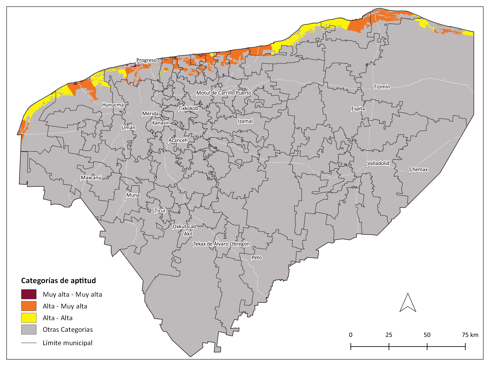
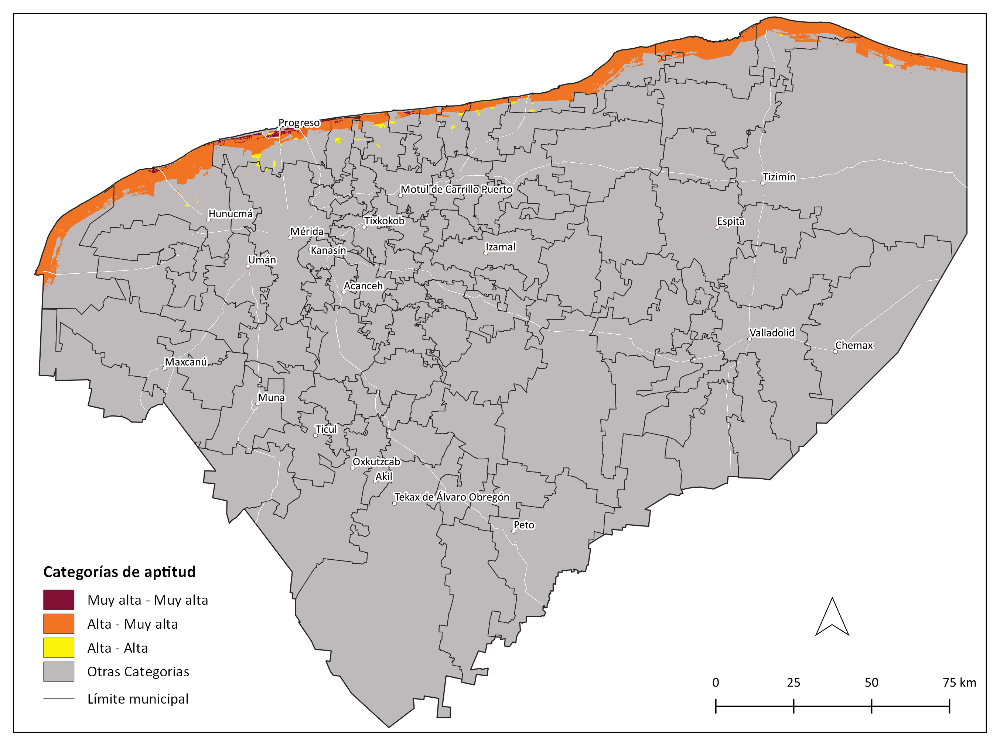
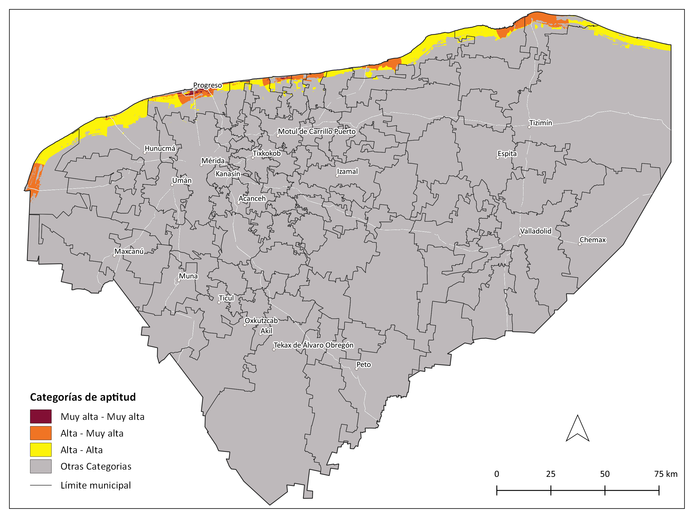

# Turismo de sol y playa

## Turismo de sol y playa **vs.** Acuacultura salobre

### Descripción del conflicto

- La construcción desmedida de casa de verano en terrenos de línea de costa reduce espacios para la acuacultura.

#### Recursos afectados

* Espacio físico.

#### Ubicación reportada

- Sin dato.

#### Fuentes

- Clave de registro en encuesta de conflictos ambientales: F43.

### Superficie de conflicto por categorías de aptitud (km²)

### Mapa de conflictos

Los conflictos ambientales resultan de la sopreposición de las categorías Alta y Muy alta de aptitud de los dos sectores incompatibles.

### Índices de conflictos ambientales

Los índices indican la severidad del conflicto y pueden tener valores entre 0 y 1.

## Turismo de sol y playa **vs.** Conservación

### Descripción del conflicto

- Desbalance en el flujo de sedimentos en el sistema playa-duna por construcción de espigones y por eliminación de dunas o su vegetación para construcción de infraestructura turística.
- Pérdida y fragmentación de ecosistemas por el cambio de uso de suelo para construcción de in-fraestructura turística y casas de verano.
- Contaminación de lagunas costeras y el mar por descarga de aguas residuales, debido a la falta de drenaje y de plantas de tratamiento.
- Contaminación de humedales costeros por residuos sólidos.

#### Recursos afectados

* Agua, vegetación forestal, duna-playa, humedales, manglares, áreas naturales protegidas.

#### Ubicación reportada

- Zona costera de Celestún, Chuburná, Tulix, La Casona, San Benito, Holchit, Punta Cancunito, Alegrías y El Cuyo, Sisal, Progreso y Telchac Puerto (las tres últimas concentran más del 80% de segundas residencias).

#### Fuentes

- Batllori 2019, García de Fuentes et al. 2019, FAO-SEDER-Gobierno de Yucatán 2016, García de Fuentes et al. 2011, Kauffer y Villanueva 2011, Torres et al. 2010.
- Clave de registro en encuesta de conflictos ambientales: F15, F40 y F43.

### Superficie de conflicto por categorías de aptitud (km²)

### Mapa de conflictos

Los conflictos ambientales resultan de la sopreposición de las categorías Alta y Muy alta de aptitud de los dos sectores incompatibles.

### Índices de conflictos ambientales

Los índices indican la severidad del conflicto y pueden tener valores entre 0 y 1.

## Turismo de sol y playa **vs.** Pesca

### Descripción del conflicto

- Impacto sobre humedales, esteros y arrecifes afecta hábitats costeros y acuáticos.

#### Recursos afectados

* Humedales.

#### Ubicación reportada

- Sin dato.

#### Fuentes

- Herrera Silveira 2006, Salas et al. 2006.
- Clave de registro en encuesta de conflictos ambientales: F40.

### Superficie de conflicto por categorías de aptitud (km²)

### Mapa de conflictos

Los conflictos ambientales resultan de la sopreposición de las categorías Alta y Muy alta de aptitud de los dos sectores incompatibles.

### Índices de conflictos ambientales

Los índices indican la severidad del conflicto y pueden tener valores entre 0 y 1.

## Turismo de sol y playa **vs.** Turismo de naturaleza

### Descripción del conflicto

- Obstrucción del acceso público a playas por construcción de casas.

#### Recursos afectados

* Humedales, playa.

#### Ubicación reportada

- Se agudiza en municipios de la zona central, específicamente en el corredor Chelem-Progreso-Telchac Puerto.

#### Fuentes

- García de Fuentes et al. 2011.

### Superficie de conflicto por categorías de aptitud (km²)

### Mapa de conflictos

Los conflictos ambientales resultan de la sopreposición de las categorías Alta y Muy alta de aptitud de los dos sectores incompatibles.

### Índices de conflictos ambientales

Los índices indican la severidad del conflicto y pueden tener valores entre 0 y 1.

