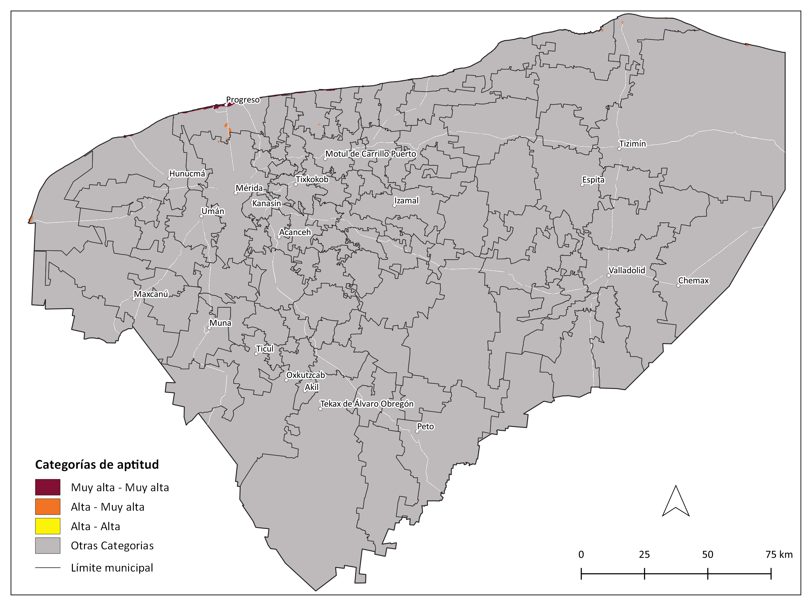

# Urbano

## Urbano **vs.** Conservación

### Descripción del conflicto

- Afectaciones al flujo hidrológico de humedales por desmonte de manglares o rellenos para cons-trucción de desarrollos urbanos y caminos de acceso en la periferia de humedales.
- Desbalance en el flujo de sedimentos en el sistema playa-duna y erosión de las playas debido a la eliminación de dunas o de su vegetación por desarrollo urbano.
- Pérdida y fragmentación de ecosistemas (en particular selva baja caducifolia) por cambio de uso de suelo debido al crecimiento de las áreas urbanas.
- Contaminación del acuífero, cenotes, lagunas costeras y el mar por descarga de aguas residuales, debido a la falta de drenaje, de plantas de tratamiento y de mantenimiento de fosas sépticas.
- Intrusión salina por extracción de agua para abasto urbano.
- Contaminación del acuífero y acumulación de basura por la falta de sistemas para el manejo integral de los residuos.

#### Recursos afectados

* Agua, biodiversidad, vegetación forestal, humedales, playa-duna, suelo.

#### Ubicación reportada

- Municipios: Abalá, Cenotillo, Chocholá, Cuzamá, Homún, Huhí, Hunucmá, Izamal, Kantunil, Kaua, Kopomá, Mérida, Motul, Progreso, Tecoh, Temozón, Tizimín, Valladolid, Yaxcabá.
* Regiones: II Noroeste, Zona central de Mérida.
- Zonas urbanas y peri-urbanas (Ciudad Caucel, Fracc. Los Héroes, Fracc. Las Américas), ZMM (Mé-rida, Conkal, Kanasín, Progreso, Ucú y Umán), Chicxulub Pueblo, Dzemul, Ixil, Izamal, Hunucmá, Telchac Puerto y Tixpéhual.
- UMAFOR 3105: 16 municipios (Cenotillo, Chankom, Dzitás, Hocabá, Hoctún, Huhí, Izamal, Kantu-nil, Quintana Roo, Sanahcat, Sotuta, Sudzal, Tekal de Venegas, Tunkás, Xocchel, Yaxcabá).
- Zonas: Oriente, zona costera de Celestún, Sisal, Chuburná, Tulix, La Casona, San Benito, Holchit, Punta Cancunito, Alegrías y El Cuyo; localidades costeras turísticas.
- Reserva ecológica municipal de Cuxtal.
- Tramo Mérida- Tulum del tren maya.
- Áreas inmediatas al este de Chelem (1.5 km de longitud de playa), Chuburná (2 km), Uaymitun (2.7 km).

#### Fuentes

- Rodríguez-Robayo et al. 2020, Barba Macías et al. 2019, Batllori 2019, García de Fuentes et al. 2019, González Herrera et al. 2018, Ortiz-Pech et al. 2017, Batllori 2016, Cepeda y Amoroso 2016, Cue-vas et al. 2016, FAO-SEDER-Gobierno de Yucatán, 2016, Corona Romero et al. 2015, Ellis et al. 2015, Hoogesteijn et al. 2015, Bolio Osés 2014, Gobierno del estado de Yucatán 2013, Ch´iibal Mayao´ob A.C. 2011, García de Fuentes et al. 2011, Kauffer y Villanueva 2011, Torres et al. 2010, Salas et al. 2006.
- Taller urbano.
- Clave de registro en encuesta de conflictos ambientales: F10, F22, F24, F33 y F38.

### Superficie de conflicto por categorías de aptitud (km²)

### Mapa de conflictos

Los conflictos ambientales resultan de la sopreposición de las categorías Alta y Muy alta de aptitud de los dos sectores incompatibles.

### Índices de conflictos ambientales

Los índices indican la severidad del conflicto y pueden tener valores entre 0 y 1.

## Urbano **vs.** Turismo de naturaleza

### Descripción del conflicto

- Desbalance en el flujo de sedimentos en el sistema playa-duna y erosión de las playas debido a la eliminación de dunas o de su vegetación por desarrollo urbano.

#### Recursos afectados

* Playa-duna.

#### Ubicación reportada

- Municipios: Dzemul, Ixil, Progreso y Telchac Puerto.
- Costa norte de Yucatán, zona costera de Celestún, Sisal, Chuburná, Tulix, La Casona, San Benito, Holchit, Punta Cancunito, Alegrías y El Cuyo.
- Áreas inmediatas al este de: Chelem (1.5 km de longitud de playa), Chuburná (2 km), Uaymitun (2.7 km).

#### Fuentes

- García de Fuentes et al. 2019, Cuevas et al. 2016, Ellis et al. 2015, García de Fuentes et al. 2011, Torres et al. 2010.

### Superficie de conflicto por categorías de aptitud (km²)

### Mapa de conflictos

Los conflictos ambientales resultan de la sopreposición de las categorías Alta y Muy alta de aptitud de los dos sectores incompatibles.

### Índices de conflictos ambientales

Los índices indican la severidad del conflicto y pueden tener valores entre 0 y 1.

## Urbano **vs.** Turismo de sol y playa

### Descripción del conflicto

- Desbalance en el flujo de sedimentos en el sistema playa-duna y erosión de las playas debido a la eliminación de dunas o de su vegetación por desarrollo urbano.

#### Recursos afectados

* Playa-duna.

#### Ubicación reportada

- Municipios: Dzemul, Ixil, Progreso y Telchac Puerto.
- Costa norte de Yucatán, zona costera de Celestún, Sisal, Chuburná, Tulix, La Casona, San Benito, Holchit, Punta Cancunito, Alegrías y El Cuyo.
- Áreas inmediatas al este de: Chelem (1.5 km de longitud de playa), Chuburná (2 km), Uaymitun (2.7 km).

#### Fuentes

- García de Fuentes et al. 2019, Cuevas et al. 2016, Ellis et al. 2015, García de Fuentes et al. 2011, Torres et al. 2010.

### Superficie de conflicto por categorías de aptitud (km²)

### Mapa de conflictos

Los conflictos ambientales resultan de la sopreposición de las categorías Alta y Muy alta de aptitud de los dos sectores incompatibles.

### Índices de conflictos ambientales

Los índices indican la severidad del conflicto y pueden tener valores entre 0 y 1.

